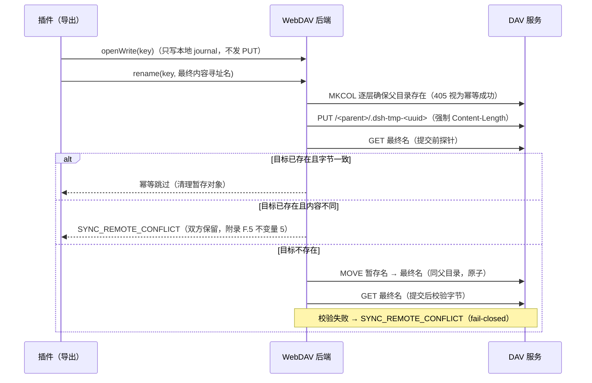

# WebDAV 适配设计稿：用坚果云标准 DAV 接口实现 SyncProvider 接口（`remote-move` profile）

> 状态：**设计稿，未实现**。本文是 WebDAV 适配的完整设计：如何用坚果云标准 DAV 接口（服务端行为实测摘要已内联为本文**附录 A**），逐方法实现 `session-sync.md` 附录 F.7 定义的 `SyncProvider` 接口，以及其上层 `SyncRootFs` 目录契约的提交协议、错误映射、陷阱、测试计划与实现前缺口。
>
> 定位：阶段 2 首个 `cloud` 后端的适配层——跑在 Harness 进程内，用厂商 WebDAV API 直接支撑 `SyncRootFs` 的 8 个方法，不引入内核挂载，不维护本地完整镜像。能力 profile（附录 G.8）：`commitMode: 'remote-move'` + `changesModel: 'full-scan'` + `authModel: 'basic-asp'`。阶段 1 生产配置仅允许 `backend: dir`；`backend: cloud` 在实现落地并跑通契约测试（附录 I）前由配置校验拒绝，不得自动退回 `dir`。
>
> 附录 A 描述的是单一服务（坚果云标准 DAV 面，不含 `NsDav*` / `NSDav*` 扩展）的当前实现，本文的映射不能未经验证推广到所有 WebDAV 服务（主文 T5、附录 J Q21）。目录索引与代码落位见 [index.md](./index.md)。

## 1. 目标接口（session-sync.md 附录 F.7）

```ts
interface SyncProvider {
  authorize(): Promise<Credential>
  refresh(c: Credential): Promise<Credential>
  revoke(c: Credential): Promise<void>
  changes(cursor?: string): Promise<{ entries: RemoteEntry[]; cursor: string }>
  putObject(path: string, source: ReadableStream, bytes: number): Promise<{ rev: string }>
  move(from: string, to: string): Promise<void>
  getObject(path: string): Promise<ReadableStream>
  statObject(path: string): Promise<RemoteMeta | undefined>
}
```

因此 `putObject` 与 `move` 不是"写最终名 + 改名"，而是**提交协议的两段**：`putObject` 只写同父目录暂存名，`move(暂存名 → 最终名)` 才是提交点（见 §3.3 / §3.4，协议全貌见 §5）。

## 2. 公共请求规则

| 项 | 规则 | 依据（附录 A） |
|---|---|---|
| 资源路径 | `<DAV_BASE_URL>/dav/<sandbox>/<path>`；sandbox 与路径段逐段 URL 编码、保留分隔符 `/`；目录资源建议带末尾 `/` | §1.1 |
| 认证 | `Authorization: Basic <base64(username:ASP)>`；ASP 是应用专用密码，不是登录密码；401 时响应带 `WWW-Authenticate: Basic realm="nutstore"` 且**没有 XML 错误体** | §1.2、§1.4 |
| 常用请求头 | `Depth`（PROPFIND/COPY）、`Destination`（COPY/MOVE，绝对 URI）、`If-Match`（PUT）、`If-None-Match`（GET/HEAD）、`Range`/`If-Range`（GET） | §1.3 |
| `Overwrite` | COPY/MOVE 实现不读取该头；不要依赖它改变覆盖行为 | §1.3 |
| 错误体 | `Content-Type: text/xml; charset=UTF-8`；`<s:exception>` 给出错误名；认证类错误无 XML 体，只能按状态码判 | §1.4 |
| 客户端纪律 | 凭据只经 Authorization 头传输（`redirect: 'error'`，不跟随重定向）；日志只记录状态码 / 对象 hash / 字节数，不记录凭据与完整 URL | 附录 H.2.1 |

## 3. SyncProvider 逐方法映射

### 3.1 `authorize()` / `refresh()` / `revoke()` —— basic-asp 模型

没有 OAuth（附录 G.7）：无 PKCE、无 device code、无 refresh token，也就没有 `SYNC_AUTH_DENIED`。

**`authorize()`** = 凭据录入 + 连通性自检，全部用读操作，不触发任何写：

1. `OPTIONS /` → 期望 200；读 `DAV: 2` 与 `Allow`（§3.1）。注意 `Allow` 固定串不含 `HEAD` / `PROPPATCH`，但两者实际已注册（§2.1）——以实际路由为准，不要仅凭 `Allow` 判能力。
2. `PROPFIND /dav/`，`Depth: 1`，请求体 `<d:propfind><d:allprop/></d:propfind>` → 207 Multi-Status；解析 `href` 列表，校验目标 sandbox 出现（§3.2）。**这一步是必须的**：MKCOL 会把拼错的第一段名隐式建成新 sandbox（§3.4 陷阱，见 §7.1）。
3. `PROPFIND /dav/<sandbox>/`，`Depth: 0` → 207，确认 sandbox 根可读。
4. `PROPFIND /dav/<sandbox>/<remoteRoot>/`，`Depth: 0` → 207 或 404（404 = 尚未创建，允许）。

`Credential` = `{ baseUrl, sandbox, username, asp }`；`asp` 只进 OS credential store（附录 G.7）。

**`refresh(c)`**：WebDAV 没有 token / 过期语义，每次请求都带同一组凭据。等价实现：任选一个只读 PROPFIND 重放；非 401 → 凭据有效；401 → `SYNC_AUTH_EXPIRED`，停止上传与拉取，不降级匿名，也不静默切换到 `dir` 后端。

**`revoke(c)`**：WebDAV 没有 revoke 端点。按主文 T8 拆成两层，不把 OAuth revoke 语义当成通用：

- 远端撤销：提示用户在坚果云后台删除该应用专用密码（产品文档指引，不是 API 调用）；
- 本地清除：删除 credential store 记录与本地状态文件，状态机回到 `SYNC_AUTH_REQUIRED`。

### 3.2 `changes(cursor?)` —— full-scan 全树扫描

WebDAV 没有对应 Dropbox cursor / Drive changes token 的服务端游标（附录 G.4），`cursor` 退化为**本地"扫描代次"标记**，跨重启保留、只用于合并扫描结果，不是服务端 token。

实现：从 `remoteRoot` 出发逐层全量 `PROPFIND Depth: 1`（递归要自己逐层做，`Depth: infinity` 在该实现下仍只返回直接子项，§3.2），并**必须跟随分页**：目录列表被截断时，响应头给出 `Link: <<URL>?mk=<marker>>; rel="next"`，客户端应直接请求 `Link` 中的下一页 URI，保留原 `Depth` 与请求体（§3.2）。漏跟 `mk` 分页等于静默漏项，直接违反 C5 / C8。

产出 `RemoteEntry`：

```text
{ path, isCollection, etag?, contentLength?, lastModified? }   // 来自 207 的 propstat
```

- `isCollection` 判据：`resourcetype` 是否含 `<collection/>`（§3.2 默认属性表）。不要用 `getcontentlength` 区分目录与空文件——目录的 `getcontentlength` 固定为 `0`。
- ETag 属性成组：`getetag` 会随 `resourcetype` / `getcontenttype` 一并输出，请求时必须同时带这三个属性（或直接 allprop），否则拿不到 ETag；若某 `propstat` 状态为 404（未生成任何属性），解析要容忍。
- `href` 是转义后的绝对路径（`/dav/<sandbox>/<path>`）：逐段解码后强制校验仍在 `<sandbox>` 前缀内，越界即 `SYNC_ROOT_INVALID`。
- 与本地 `index` 中 `(path, etag, bytes)` 比对判定远端变化；ETag 未变即跳过下载。
- 目录 `getlastmodified` 可做子树剪枝，但**只能当优化、不能当保证**（依赖服务端目录时间语义，附录 G.4 / J Q18）。

### 3.3 `putObject(path, source, bytes)` —— 上传到暂存名

`path` 由后端传入，**不是插件看到的最终路径**，而是目标对象同父目录下的暂存名 `.dsh-tmp-<uuid>`（附录 G.1：插件传入的路径不参与远端布局；暂存必须与目标同目录，否则 `MOVE` 跨目录不原子，破坏 C2）。

请求（§3.5）：

```http
PUT <DAV_BASE_URL>/dav/<sandbox>/<parent>/.dsh-tmp-<uuid>
Authorization: Basic <base64(username:ASP)>
Content-Length: <bytes>
Content-Type: application/octet-stream

<bytes 字节的二进制内容>
```

硬约束与语义：

- `Content-Length` 必须存在且 ≤ 服务端 `webUploadMaxSize`；**不接受 chunked body**——所以 `source` 必须先在本地 journal 落盘拿到确切长度（附录 F.3 `openWrite` 只写本地 journal），不可能边生成边直传；
- 父目录必须已存在（缺失返回 `409 AncestorsNotFound`）——调用方（`rename` 组合层）先用逐层 `MKCOL` 保证（§3.4：`405 ResourceExisted` 视为幂等成功）；
- 成功：`201 Created`（新建）或 `204 No Content`（覆盖），响应带 `X-File-Version`；
- `400 TooBigEntity` → `SYNC_UPLOAD_TOO_LARGE`（主文 T6 的统一决定），远端不留半截对象；
- `403 StorageSpaceExhausted` → `SYNC_QUOTA_EXCEEDED`；401 → `SYNC_AUTH_EXPIRED`；503 → 指数退避。

**返回 `rev` 的兜底**（附录 F.7：缺少 rev 的 provider 在适配层用内容哈希兜底）：WebDAV 没有跨设备版本号。优先 `PUT` 后对暂存名 `PROPFIND Depth: 0` 取 `getetag`；服务端不返回 ETag 时退化为内容 SHA-256。`X-File-Version` 只在同一会话内递增，跨设备语义未验证（T2/T5），仅作诊断，不作为 `rev`。

### 3.4 `move(from, to)` —— 提交点

请求（§3.10）：

```http
MOVE <DAV_BASE_URL>/dav/<sandbox>/<from>
Destination: <DAV_BASE_URL>/dav/<sandbox>/<to>
```

- `from` 是 `putObject` 刚写的暂存名，`to` 是最终内容寻址名；**两者必须同父目录**——同一 sandbox 且源目标父目录相同才走原子重命名路径，其他情况是"复制源对象 + 删除源对象"（不原子，破坏 C2）。跨目录 `MOVE` 由后端拒绝并改写为同目录暂存（契约测试用例）。
- `Destination` 必填，值为绝对 URI；目标不能是 sandbox 根。
- 实现**不读取 `Depth`，也不读取 `Overwrite`**（§3.10）——不要试图用 `Overwrite: F` 表达"不可覆盖"。
- 成功：`201 Created`。
- 目标已存在：`405 ResourceExisted` 或 `409 DuplicateName` → **不覆盖**，转入内容比较分支（提交前探针已拦下大多数情形；这里的 405 分支只兜探针与提交之间的竞态，见 §5.3）；
- `409 ConcurrentUpdate` / `FileBeingLocked`、`412`、`503` → 指数退避重试（错误映射见 §6）；
- 注意：`MOVE` 对不存在的源返回 `404 ObjectNotFound` → `SYNC_PROVIDER_ERROR`（暂存对象丢失，属实现 bug，不是厂商冲突）。

### 3.5 `getObject(path)` —— 下载

`GET /dav/<sandbox>/<path>`（§3.6）：

- 200 + 二进制体；`ETag` 响应头可用于缓存校验：`If-None-Match` 与服务端 ETag **精确字符串相等**时返回 304（该实现按字符串比较，不处理弱校验/通配符/多值列表）；
- 断点续传：`Range: bytes=<start>-`（`bytes=start-end` 与 `bytes=start-` 稳定支持；**`bytes=-N` 被按"从起始位置开始"处理，禁止使用**）；范围无效返回 `416`，此时丢弃续传状态重下整个对象；`If-Range` 不匹配时服务端忽略 `Range` 返回完整 200；
- 空文件返回 200 + 空体；目录与 sandbox 根不可 GET；
- 读到不完整或哈希不符 → 报错，绝不返回脏数据（附录 F.3）。

### 3.6 `statObject(path)` —— 元数据

`PROPFIND /dav/<sandbox>/<path>`，`Depth: 0`，allprop（§3.2）：

- `207` → 解析第一个 `d:response`：`isCollection`（`resourcetype`）、`getcontentlength`（仅文件）、`getetag`（仅文件，可能为空元素）、`getlastmodified`（RFC 1123）；
- `404 ObjectNotFound` → `undefined`（不是错误）；
- 目录的 `getetag` 通常为空元素 → 目录 `RemoteMeta.etag` 视为 undefined，mtime 用 `getlastmodified`；
- 解析出的 `href` 必须解码后仍在 `<sandbox>` 前缀内（与 §3.2 同一规则）。

### 3.7 关于 `DELETE`

`SyncProvider` **没有 delete 方法**——契约 C7 禁止后端删除已提交对象（远端 `DELETE` 是递归删除，§3.8；sandbox 根不可删）。允许的唯一例外：清理我们自己失败残留的 `.dsh-tmp-*` 暂存名（单文件 DELETE）。revision 回收（GC）是插件侧或用户的显式操作（附录 J Q3），不走 provider。

## 4. 目录契约层：`SyncRootFs` 方法由 `SyncProvider` 组合

`WebDavSyncRoot`（`remote-move` profile）在上层用本文的动词组合出插件依赖的 `SyncRootFs`（附录 B.1）：

| `SyncRootFs` | 组合方式 | 关键点 |
|---|---|---|
| `stat` | `statObject`（`PROPFIND Depth: 0`） | 目录不用 `HEAD` 探测（集合 URI 带末尾 `/` 时 `HEAD` 返回 403）；`404` → `undefined` |
| `readdir` | `changes` 的单层切片（逐层 `PROPFIND Depth: 1`） | 必须跟随 `mk` 分页，漏跟即违反 C5/C8 |
| `openRead` | `getObject`（小对象协议全量读） | `bytes=-N` 禁用；`416` 重下 |
| `openWrite` | 只写本地 `journal`，不发 `PUT` | `PUT` 强制 `Content-Length`，不可能边生成边直传 |
| `rename` | `putObject(暂存名)` → 提交前探针 → `move(暂存名 → 最终名)` → 提交后校验 | 见 §5 |
| `mkdir` | 逐层 `MKCOL`；`405 ResourceExisted` 视为成功 | 每层都在"已知存在的 sandbox 之下至少一层"，见 §7.1 |
| `fsync` | 本地 `journal` 落盘 | 不承诺远端可见（C6）；远端发现靠插件触发的全树扫描（附录 G.4） |
| `unlink` | 只清本地 `journal`/`index`，不调用远端 `DELETE` | 远端 DELETE 是递归的，绝不由插件侧触发（C7），见 §3.7 |

PROPFIND 的通用规则（属性成组、32 KiB 请求体上限、`href` 解码与 sandbox 前缀校验）见 §3.2；请求构造与解析细节见 §9。

## 5. 提交协议（核心设计）

`PUT`（写同目录临时名）+ `MOVE`（同目录改名到最终名）就是附录 D.1.4「先写 tmp 再 rename」的服务端版本，插件的导出写入路径零改动。提交序列：



设计要点：

1. **提交前探针优先于 MOVE**（对附录 G.5 草案"提交后校验"的强化）：先 `GET` 最终名（小对象协议直接字节比较），已存在就不发起 `MOVE`。理由：RFC 4918 默认 `Overwrite: T`，"MOVE 到已存在目标会失败"是该服务的行为而非 RFC 保证（主文 T2）；探针先行后，即使某服务端静默覆盖，覆盖行为也触不到已提交对象。探针 GET 走 503/412 退避重试。
2. **暂存名与目标同目录**：`.dsh-tmp-<uuid>`，点开头。禁止把 `<syncRoot>/dsh-session-sync/tmp/` 当作 WebDAV 暂存位置——跨目录 MOVE 是"复制 + 删除"，不原子，直接破坏 C2（附录 G.1）。`openWrite` 传入的路径只在本地 journal 中生效，远端暂存名由后端生成。
3. **竞态兜底**：探针说目标不存在、MOVE 却返回 `405 ResourceExisted` / `409 DuplicateName` 时，转入内容比较（仅凭"已存在"不能推导内容不同）：同内容 → 另一设备已提交同对象，幂等跳过；不同 → `SYNC_REMOTE_CONFLICT`。
4. **清理边界**：`DELETE` 只作用于我们自己的 `.dsh-tmp-*` 暂存名；已提交对象永不删除（C7）。
5. **禁用项**：不用 LOCK 互斥（lock type/scope/timeout 是固定返回值，UNLOCK 不校验 `Lock-Token`）；不用 PROPPATCH 存任何状态（返回 200 但不持久化）。单写者靠本地 lockfile + 不可覆盖提交（附录 J Q11 的 WebDAV 答案）。
6. **本地状态的角色**：附录 F.4 的状态机在此退化为 `PUT(tmp) → MOVE(final)`，`index` 从正确性边界降级为纯缓存；`journal` 中的暂存字节经 `putObject` 上传，MOVE ack 后提交，崩溃恢复见 §12。

## 6. 错误映射（附录 G.6 + T6 统一结论）

| DAV | `exception` | 映射 |
|---|---|---|
| 400 | `TooBigEntity` | **`SYNC_UPLOAD_TOO_LARGE`**（T6 的统一选择：超限是一个对外语义，不再落到 `SYNC_PROVIDER_ERROR`） |
| 400 | `IllegalArgument` / `TooManyASPs` | `SYNC_PROVIDER_ERROR`（后者提示清理已失效的应用密码） |
| 401 | `AuthenticationFailed` / `UnAuthorized` / `NoSuchUser` | `SYNC_AUTH_EXPIRED`；认证类错误没有 DAV XML 体，只能按状态码判；提示文案必须写明"需要应用专用密码（ASP），不是登录密码" |
| 403 | `SandboxAccessDenied` / `OperationNotAllowed` | `SYNC_PROVIDER_ERROR`（sandbox 只读或离线：读得到、写不了，状态页显式提示） |
| 403 | `StorageSpaceExhausted` | `SYNC_QUOTA_EXCEEDED` |
| 404 | `ObjectNotFound` | 不是错误：`statObject` → `undefined`；目录列举 → `SYNC_ROOT_INVALID` |
| 405 | `ResourceExisted` | `mkdir` 视为成功；`rename` 转入内容比较分支（§5.1/5.3）；单次响应不等于整个服务的 C4 已得到证明 |
| 409 | `AncestorsNotFound` | `SYNC_PROVIDER_ERROR`（父目录缺失，属实现 bug） |
| 409 | `DuplicateName` | 同 405，转内容比较；`ConcurrentUpdate` / `FileBeingLocked` 退避重试 |
| 412 | `PreconditionFailed` / `FileUnlocked` | 退避重试；持续失败透传 `SYNC_REMOTE_CONFLICT`（厂商结论，非本端判定） |
| 416 | `RangeNotSatisfied` | 丢弃续传状态，重下整个对象 |
| 503 | `ServiceUnAvailable` / `BlockedTemporarily` | 指数退避，最终报 `SYNC_PROVIDER_ERROR` |

## 7. 四个必须遵守的陷阱（附录 A 实证，附录 G.3）

1. **MKCOL 隐式建 sandbox**：目标 URI 第一段不是现有 sandbox 且无后续路径时，服务端把该名称当作新 sandbox 创建并返回 201。首次连接必须 `PROPFIND /dav/` 校验目标 sandbox 存在，任何 MKCOL 都在"已知存在的 sandbox 之下至少一层"执行。拼错 sandbox 名不会报错，而是两台设备各建一个、永久对不上。
2. **PROPPATCH 假装成功**：对 `Win32*` 属性返回 200 但不保存任何东西。禁止用 dead properties 存任何状态（分支指针、manifest 索引、设备 id）。
3. **LOCK 不能用作互斥**：见 §5.5。单写者只能靠本地 lockfile + "已存在即失败"的提交语义。
4. **Content-Length 是硬约束**：`PUT` 受服务端 `webUploadMaxSize` 限制，缺失长度或 chunked body 直接失败。附录 C.1 把附件按单个 sha256 对象存放，大附件可能超限 → 报 `SYNC_UPLOAD_TOO_LARGE`，不允许静默截断；对象级分块是附录 J Q17 的开放问题。

## 8. 凭据与配置草案

HTTP Basic（账号 + ASP），没有 OAuth（附录 G.7）：`/sync cloud login` 对 WebDAV 退化为"填 baseUrl / sandbox / username / ASP + 连通性自检"，`SYNC_AUTH_DENIED` 在该 provider 下不会出现。凭据经 OS credential store 注入（`credentialsRef: keychain:dsh-session-sync/webdav`），不落配置；配置只放：

```yaml
syncCloud:
  enabled: false            # 显式启用才自检连通性
  provider: webdav
  baseUrl: https://dav.example.com
  sandbox: DSH Sync         # 网盘/同步盘名称；首次连接 PROPFIND /dav/ 校验存在
  remoteRoot: /dsh-session-sync   # sandbox 内路径；不允许为空或指向 sandbox 根（附录 F.11 校验）
  username: user@example.com      # 非 secret
  stateDir: ~/Library/Application Support/dsh-sync/state
  intervalSeconds: 60
```

`baseUrl` / `sandbox` 为空、`remoteRoot` 为空或指向 sandbox 根、sandbox 编码后与服务端实际名不一致 → 配置校验拒绝。

## 9. 请求构造与解析的实现注意

1. **URL 构造**：`sandbox` 整体 `encodeURIComponent`；`path` 按段编码、不编码 `/`。对 `/dav/`（sandbox 列表）等顶层 URI 要绕过 sandbox 前缀拼接。
2. **207 解析**：`multistatus` 里每个 `d:response` 对应一个资源（§4.1）；`Depth: 1` 的响应同时包含目标自身，解析时按 `href` 去掉自身。命名空间前缀可能有 `d:` 或无前缀，解析要容忍。
3. **分页循环**：`Link` 头优先于响应体内的 `d:link`；下一页 URI 直接使用（绝对 URL），保留 `Depth` 与请求体，直到没有 `Link`。
4. **超时与退避**：请求级超时；`503 ServiceUnAvailable` / `BlockedTemporarily`、`409 ConcurrentUpdate`、`412` 指数退避（附录 G.6），`maxRetries` 次后透传最终错误。
5. **凭据卫生**：401 的响应没有 XML 体——错误分类只看状态码；日志不落凭据、授权头、完整 URL（附录 H.2.1）。

## 10. 测试计划（附录 I 替身用例的行为规格）

Fake DAV server（内存替身，不依赖真实网盘）需模拟：Basic 认证（401 无 XML 体）、207 Multi-Status 与 `?mk=` 分页（`pageSize` 可配）、MKCOL 陷阱（第一段未知 → 隐式建 sandbox）、PUT 强制 Content-Length 与 `maxUpload` 上限（400 `TooBigEntity`）、MOVE 同父原子/跨父"复制+删除"/目标已存在默认 405。替身开关对应契约用例：

| 用例 | 替身配置 | 断言 |
|---|---|---|
| C1/C2 提交可见性 | 默认 | rename 后 stat/read 一致，ETag 来自内容 |
| C4 分支 a：幂等跳过 | 默认（MOVE 遇已存在 → 405） | 同内容重提交成功、对象保持、无重传 |
| C4 分支 b：内容冲突 | 默认 | `SYNC_REMOTE_CONFLICT`，厂商端目标未被覆盖 |
| C4 违约替身 | `moveOverwrites`（MOVE 静默覆盖并返回 201） | 探针先行拦截，`SYNC_REMOTE_CONFLICT`，目标保持旧字节 |
| 探针竞态 | `probeHidesTarget`（GET 404 但 MOVE 撞已存在） | 405 分支转入内容比较，幂等跳过 |
| C5 分页完整性 | `pageSize` 截断 + `Link` 头 | readdir 跟到最后一页不漏项；不跟分页必须让该用例失败 |
| 同父目录约束 | 请求日志 | 暂存名与目标同目录，`MOVE` 源是 `.dsh-tmp-*` |
| Content-Length | fake 对缺长度返回 400 | 后端所有 PUT 都带长度 |
| 超限 | `maxUpload` 调小 | `SYNC_UPLOAD_TOO_LARGE`，远端无半截对象 |
| 退避重试 | `failFirst` 次 503 | 重试后成功 |
| href 解码 | 中文/空格/`#` 文件名 | 解码域往返一致，越界 href 报 `SYNC_ROOT_INVALID` |
| C7 | 请求日志 | DELETE 只出现在 `.dsh-tmp-*` |
| 陷阱禁用 | 请求日志 | LOCK / PROPPATCH 调用数为 0 |
| 后端一致性 | 同一 bundle 经 `dir` 与 webdav | 目录视图等价（附录 I 判据） |

## 11. 契约声明与验证义务

- 声明：必需条款 C1–C5、C7、C8 全部满足；C6 为弱保证（fsync 只承诺本地 journal）。
- 契约自检：`declaredContract` 与附录 B.3 必需条款取交集，在 `scan()` 时执行；缺必需条款 → `SYNC_ROOT_CONTRACT_UNMET`，fail-closed。
- **C4 的证明义务**（主文 T2）：防覆盖依赖"探针先行 + 服务端 MOVE 拒绝已存在目标"的组合。探针覆盖了静默覆盖服务端；但"探针 GET 与 MOVE 之间的竞态窗口"依赖服务端对已存在目标报 405/409，这一半仍须逐服务验证。验证未通过的服务不得启用本 profile（摘除 C4 → `SYNC_ROOT_CONTRACT_UNMET` fail-closed）。
- 运行前自检：`PROPFIND /dav/`（sandbox 存在）+ `OPTIONS`（能力头）+ `PROPFIND <remoteRoot>`（存在性与类型）。

## 12. 实现前必须补齐的缺口

| 缺口 | 依据 |
|---|---|
| journal 持久化与单机 lockfile：`openWrite` 的暂存字节必须先落盘（`stateDir` + append-only + 原子 rename），丢失即 `SYNC_JOURNAL_LOST` 显式报错 | 附录 F.8 |
| 大附件对象级分块（`<sha256>.part<n>` + 清单），分块后 C3/C4 作用域从单文件变为一组文件 | 附录 J Q17 / §7.4 |
| 全树扫描成本与目录 `getlastmodified` 剪枝：剪枝只能当优化、不能当保证 | 附录 G.4 / J Q18 |
| 探针频率策略（每次 rename 一次 vs 首连 + 抽样） | 附录 J Q19 |
| 真实坚果云环境验证 T2/T5/T6 后才可声明能力 | 主文 T2/T5/T6、附录 J Q21 |

---

## 附录 A：坚果云标准 DAV 接口速查（内联副本）

> 本附录是接口事实的**内联完整副本**，来源为对服务端 `/dav` 标准面的实测摘要（原独立文档 `DAV_API.md` 已并入此处，不再单独引用）。它描述**当前实现**，不等同于完整 RFC 4918 能力声明；不含 `NsDav*` / `NSDav*` 扩展接口。接口路由由 `AppServerRequestResolver` 注册，DAV 资源路径以 `/dav/` 开头；`/` 仅对 `OPTIONS` 和 `PROPFIND` 提供兼容性入口。本文正文的 §1.1–§4.1 等编号即指向本附录的同名小节。

### A.1 基本约定

#### A.1.1 服务地址和资源路径

占位符约定：

```text
<DAV_BASE_URL>  = WebDAV 服务的 scheme、域名和端口，例如 https://dav.example.com
<sandbox>       = 网盘/同步盘名称。名称中包含特殊字符时必须进行 URL 编码
<path>          = sandbox 内的文件或目录路径，目录分隔符为 /
```

资源路径的映射关系：

| URI | 含义 | 备注 |
| --- | --- | --- |
| `/` | 服务根视图 | 只用于 `OPTIONS`、`PROPFIND`；`PROPFIND` 将其视为只读虚拟资源 |
| `/dav/` | sandbox 列表视图 | `PROPFIND` 可读取；`OPTIONS` 可查询能力 |
| `/dav/<sandbox>` 或 `/dav/<sandbox>/` | sandbox 根目录 | 在 `PROPFIND` 中返回 sandbox 根资源 |
| `/dav/<sandbox>/<path>` | sandbox 内的文件或目录 | 读写操作的主要资源路径 |

建议对目录使用带末尾 `/` 的规范 URI；服务端解析资源时会去掉最后一个 `/`，但部分方法会据此判断资源是否为集合。返回的 `href` 会进行路径转义。客户端构造请求时也应对 sandbox 名称和文件名进行 URL 编码，但不要编码路径分隔符 `/`。

#### A.1.2 认证

所有标准 DAV 请求都需要 HTTP Basic Authentication：

```http
Authorization: Basic <base64(username:application-specific-password)>
```

- `username` 是用户账号；
- password 必须是用户的应用专用密码（Application Specific Password，ASP），不是普通登录密码；
- 标准 DAV 接口要求用户类型为普通用户，团队管理员/团队专用凭据不用于这些接口。

认证失败时返回 `401 Unauthorized`，并带有：

```http
WWW-Authenticate: Basic realm="nutstore"
```

#### A.1.3 公共请求头

| Header | 适用接口 | 说明 |
| --- | --- | --- |
| `Authorization` | 全部 | 必填，见 A.1.2 |
| `Depth` | `PROPFIND`、`COPY` | 可取 `0`、`1` 或 `infinity`；非法值返回 `400` |
| `Destination` | `COPY`、`MOVE` | 必填，值可以是绝对 URI 或包含资源路径的 URI；目标不能是 sandbox 根目录 |
| `If-Match` | `PUT` | 如果提供，必须与当前文件 ETag 完全一致 |
| `If-None-Match` | `GET`、`HEAD` | 与当前文件 ETag 完全一致时返回 `304` |
| `Range` | `GET` | 支持单个字节范围，例如 `bytes=0-99` |
| `If-Range` | `GET` | 存在且不等于当前 ETag 时忽略 `Range`，返回完整文件 |
| `If` | `LOCK` 刷新 | 用于提取 `opaquelocktoken:` 格式的锁令牌 |
| `Lock-Token` | `UNLOCK` | 标准客户端通常会发送；当前实现不读取或校验该 Header |

`Overwrite` 虽然属于 WebDAV 常见请求头，当前 `COPY` 和 `MOVE` 实现不会读取它；目标已存在时不要依赖该 Header 改变覆盖行为。

#### A.1.4 公共响应和错误

XML 响应的 Content-Type 为 `text/xml; charset=UTF-8`。非认证类业务错误通常返回 XML：

```xml
<d:error xmlns:d="DAV:" xmlns:s="http://ns.jianguoyun.com">
  <s:exception>ObjectNotFound</s:exception>
  <s:message>The resource of this location does not exist</s:message>
</d:error>
```

常见错误码及 HTTP 状态如下，具体 message 以服务端实际返回为准：

| HTTP 状态 | `exception` 示例 | 常见场景 |
| --- | --- | --- |
| `400 Bad Request` | `IllegalArgument`、`TooBigEntity`、`TooManyASPs` | 参数、XML、请求体或请求头非法 |
| `401 Unauthorized` | `AuthenticationFailed`、`UnAuthorized`、`NoSuchUser` | Basic/ASP 认证失败；认证类错误一般没有 DAV XML 错误体 |
| `403 Forbidden` | `OperationNotAllowed`、`SandboxAccessDenied`、`StorageSpaceExhausted` | 权限不足、操作不适用、空间不足 |
| `404 Not Found` | `ObjectNotFound` | sandbox、文件或目录不存在 |
| `405 Method Not Allowed` | `ResourceExisted` | 创建目录时目标已存在等 |
| `409 Conflict` | `AncestorsNotFound`、`DuplicateName`、`FileBeingLocked`、`ConcurrentUpdate` | 父目录不存在、目标重名、锁冲突或并发更新 |
| `412 Precondition Failed` | `PreconditionFailed`、`FileUnlocked` | ETag 前置条件或锁状态不满足 |
| `416 Requested Range Not Satisfiable` | `RangeNotSatisfied` | Range 超出文件范围 |
| `503 Service Unavailable` | `ServiceUnAvailable`、`BlockedTemporarily` | 服务不可用或请求频率受限 |

### A.2 接口总览

| 方法 | URI | 默认成功状态 | 请求体 |
| --- | --- | --- | --- |
| `OPTIONS` | `/`、`/dav/<...>` | `200 OK` | 无 |
| `PROPFIND` | `/`、`/dav/<...>` | `207 Multi-Status` | 可选 XML |
| `PROPPATCH` | `/dav/<...>` | `207 Multi-Status` | 忽略 |
| `MKCOL` | `/dav/<...>` | `201 Created` | 忽略 |
| `PUT` | `/dav/<sandbox>/<path>` | `201` 或 `204` | 文件二进制内容 |
| `GET` | `/dav/<sandbox>/<path>` | `200`、`206` 或 `304` | 无 |
| `HEAD` | `/dav/<sandbox>/<path>` | `200` 或 `304` | 无 |
| `DELETE` | `/dav/<sandbox>/<path>` | `204 No Content` | 无 |
| `COPY` | `/dav/<sandbox>/<path>` | `201 Created` | 无 |
| `MOVE` | `/dav/<sandbox>/<path>` | `201 Created` | 无 |
| `LOCK` | `/dav/<sandbox>/<file>` | `200 OK` | 新建锁时 XML；刷新时为空 |
| `UNLOCK` | `/dav/<sandbox>/<file>` | `204 No Content` | 无 |

#### A.2.1 `OPTIONS` 的 Allow 差异

`OPTIONS` 响应中的 `Allow` 是代码中固定的字符串：

```http
DAV: 2
Allow: DELETE, GET, LOCK, UNLOCK, MKCOL, MOVE, OPTIONS, PROPFIND, PUT, COPY
MS-Author-Via: DAV
```

当前路由实际上也注册了 `HEAD` 和 `PROPPATCH`，但它们没有出现在上述 `Allow` 值中。客户端如需使用这两个方法，应以实际路由为准，而不是仅依据 `Allow` 判断。

### A.3 接口详情

#### A.3.1 OPTIONS

查询服务器 WebDAV 能力。请求：

```http
OPTIONS <DAV_BASE_URL>/dav/Work/ HTTP/1.1
Host: dav.example.com
Authorization: Basic <base64(username:application-specific-password)>
```

也支持 `OPTIONS <DAV_BASE_URL>/`。成功响应：

```http
HTTP/1.1 200 OK
DAV: 2
Allow: DELETE, GET, LOCK, UNLOCK, MKCOL, MOVE, OPTIONS, PROPFIND, PUT, COPY
MS-Author-Via: DAV
```

响应不包含业务数据体。

#### A.3.2 PROPFIND

读取服务根视图、sandbox 列表、文件或目录属性。响应为 `207 Multi-Status`。

请求 URI 可为 `<DAV_BASE_URL>/`、`<DAV_BASE_URL>/dav/`、`<DAV_BASE_URL>/dav/<sandbox>/`、`<DAV_BASE_URL>/dav/<sandbox>/<path>`。

请求头：

| Header | 默认值 | 说明 |
| --- | --- | --- |
| `Depth` | `infinity` | `0` 只返回目标；`1` 返回目标及其直接子项；`infinity` 在当前实现中对目录仍按直接子项列表读取 |
| `Authorization` | 无 | 必填 |

当目录列表被截断时，可使用查询参数 `mk` 继续读取。服务端会在响应中返回：

```http
Link: <<DAV_BASE_URL>/dav/Work/docs?mk=<marker>>; rel="next"
```

客户端应直接请求 `Link` 中的下一页 URI，并保留原来的 `Depth` 和属性请求体。

请求体：不带请求体时，服务端按默认属性集合处理。也可以显式请求全部属性：

```xml
<?xml version="1.0" encoding="UTF-8"?>
<d:propfind xmlns:d="DAV:">
  <d:allprop/>
</d:propfind>
```

只请求指定属性：

```xml
<?xml version="1.0" encoding="UTF-8"?>
<d:propfind xmlns:d="DAV:">
  <d:prop>
    <d:displayname/>
    <d:resourcetype/>
    <d:getcontentlength/>
    <d:getcontenttype/>
    <d:getetag/>
    <d:getlastmodified/>
    <d:current-user-privilege-set/>
  </d:prop>
</d:propfind>
```

请求体由服务端按 XML 文本读取，大小上限为 **32 KiB**；超过限制或 XML 无法解析时返回 `400`。服务端按 XML 元素的 local name 识别属性；未知或当前实现不支持的属性不会生成属性值。如果最终没有生成任何属性，该 `propstat` 的状态为 `404 Not Found`。

默认属性集合：

| 属性 | 文件 | 目录/集合 | 说明 |
| --- | --- | --- | --- |
| `displayname` | 文件名 | sandbox 或目录名 | 显示名称 |
| `resourcetype` | 空的默认资源类型 | `<collection/>` | 集合标识 |
| `getcontentlength` | 文件大小（字节） | `0`（虚拟/集合资源） | 字符串形式 |
| `getlastmodified` | 文件修改时间 | 目录元数据时间；虚拟资源使用当前时间 | RFC 1123 格式，例如 `Wed, 01 Jan 2025 00:00:00 GMT` |
| `owner` | sandbox owner | sandbox owner | 当前实现返回文本值 |
| `current-user-privilege-set` | 当前用户权限 | 当前用户权限 | 读 → `read`；写 → `write`；管理 → `read`、`write`、`all`、`read_acl`、`write_acl` |
| `getcontenttype` | 根据文件名扩展名推断 | `httpd/unix-directory` | 目录固定值 |
| `getetag` | 当前实现会随 `resourcetype/getcontenttype` 一并输出 | 通常为空元素 | 文件 ETag 来自对象元数据 |

响应示例：

```http
HTTP/1.1 207 Multi-Status
Content-Type: text/xml; charset=UTF-8
```

```xml
<d:multistatus xmlns:d="DAV:" xmlns:s="http://ns.jianguoyun.com">
  <d:response>
    <d:href>/dav/Work/notes/readme.txt</d:href>
    <d:propstat>
      <d:prop>
        <d:displayname>readme.txt</d:displayname>
        <d:resourcetype/>
        <d:getcontentlength>1024</d:getcontentlength>
        <d:getcontenttype>text/plain</d:getcontenttype>
        <d:getetag>"..."</d:getetag>
        <d:getlastmodified>Wed, 01 Jan 2025 00:00:00 GMT</d:getlastmodified>
      </d:prop>
      <d:status>HTTP/1.1 200 OK</d:status>
    </d:propstat>
  </d:response>
</d:multistatus>
```

根视图的特殊行为：

- `PROPFIND /` 总是返回 `/`；当 `Depth > 0` 时还返回 `/dav/`；
- `PROPFIND /dav/` 返回 `/dav/` 和可访问的 sandbox 根资源；
- `PROPFIND /dav/<sandbox>/` 返回 sandbox 根资源，并按 `Depth` 返回子项；
- 只有当前用户可访问的对象会出现在列表中。

#### A.3.3 PROPPATCH

用于兼容部分 WebDAV 客户端的属性更新请求。请求体可以为空，也可以是客户端标准的 PROPPATCH XML；当前实现不会解析、保存或更新请求体中的属性。响应返回一个伪造的成功 `propstat`，属性名为 `Win32CreationTime`、`Win32LastAccessTime`、`Win32LastModifiedTime`、`Win32FileAttributes`，值为空、状态 `200 OK`。集合 URI（带末尾 `/`）不允许执行该操作，返回 `403`。

#### A.3.4 MKCOL

创建目录；当前实现还支持通过该方法创建一个新的 sandbox。

**隐式创建 sandbox（陷阱）**：当目标 URI 的第一段名称不是现有 sandbox 且没有后续路径时，服务端将其作为新 sandbox 标题（例如 `MKCOL /dav/New%20Work` → `201 Created`）。该 sandbox 使用默认访问控制，不通知客户端同步；不能直接创建 photo bucket。目标 sandbox 已存在时，当前实现不会按标准语义报重复资源，可能直接返回 `201`；客户端不要依赖该边界行为。

创建目录（要求父目录已经存在，且用户拥有读写权限）：

```http
MKCOL <DAV_BASE_URL>/dav/Work/projects/2025/ HTTP/1.1
Host: dav.example.com
Authorization: Basic <base64(username:application-specific-password)>
```

成功：`201 Created`。主要错误：父级路径不存在 → `409 Conflict` + `AncestorsNotFound`；目标已有文件或目录 → 通常 `405 Method Not Allowed` + `ResourceExisted`。

#### A.3.5 PUT

上传或覆盖文件。目标必须是文件路径，不能以集合形式访问。

```http
PUT <DAV_BASE_URL>/dav/Work/notes/readme.txt HTTP/1.1
Host: dav.example.com
Authorization: Basic <base64(username:application-specific-password)>
Content-Length: 13
Content-Type: text/plain

Hello Nutstore
```

约束：

- `Content-Length` 必须存在，且不能超过服务端 `webUploadMaxSize` 配置；使用 chunked body 或缺失长度会失败；
- 父目录必须存在；
- 需要目标 sandbox 的写权限，sandbox 服务状态必须为在线；
- 如果目标已存在，写入会覆盖当前文件；不能用 PUT 将集合覆盖为文件；
- 可通过 `If-Match` 进行精确 ETag 校验。ETag 不匹配返回 `412 Precondition Failed`。

响应：首次创建文件 → `201 Created` + `X-File-Version: 1`；覆盖已有文件 → `204 No Content` + `X-File-Version: <new-version>`。请求体只作为文件内容处理；服务端会按文件名扩展名推断后续下载时的 MIME 类型。

#### A.3.6 GET

下载文件内容。不能下载目录或 sandbox 根资源。成功响应包含 `200 OK`、`Etag`、`Cache-Control: max-age=5`、`Content-Disposition: attachment`，实际 `Content-Type` 根据文件名推断，响应体为文件二进制内容。空文件返回 `200` 和空响应体。

条件请求：`If-None-Match` 的值与服务端 ETag **完全一致**时返回 `304 Not Modified` + `Etag`。当前实现按字符串精确比较 ETag，不处理弱校验、通配符或多值列表。

分段下载（`Range: bytes=0-99` + 可选 `If-Range: <etag>`）：有效范围返回 `206 Partial Content` + `Content-Range: bytes 0-99/<file-size>`。代码稳定支持 `bytes=start-end` 和 `bytes=start-`；**`bytes=-N` 虽可被解析，但当前实现会按从文件起始位置开始的范围处理**，并非 RFC 语义中的"最后 N 个字节"，客户端不应依赖该形式。范围无效或超出文件大小时返回 `416 Range Not Satisfiable`；`If-Range` 不匹配时忽略 `Range` 并返回完整 `200`。

#### A.3.7 HEAD

读取资源元数据但不返回响应体。文件成功响应返回 `Last-Modified` 与 `Etag`。文件和目录都可以读取元数据，但**集合 URI 不能带末尾 `/`，否则返回 `403`**；`Last-Modified` 总会返回；只有文件返回 ETag；`If-None-Match` 精确匹配时返回 `304` 且不返回响应体。

#### A.3.8 DELETE

删除文件或目录。**目录删除是递归删除**。成功 `204 No Content`。要求用户拥有目标路径的读写权限，sandbox 服务状态必须在线。**sandbox 根目录本身不能作为删除目标**。

#### A.3.9 COPY

复制文件或目录，可跨 sandbox 复制。`Destination` 必填，目标解析后不能是 sandbox 根目录；`Depth` 默认 `infinity`（目录用 `Depth: 0` 仅创建目标空目录；文件用 `Depth: 0` 仍执行复制）；不能将目录复制到自身或其子目录；源 sandbox 需要读权限，目标 sandbox 需要写权限。当前实现不会处理 `Overwrite`，目标已存在时通常返回 `409 Conflict` + `DuplicateName`。复制任务在服务端通过后台任务执行，当前请求会等待任务状态，内部等待上限约为 35 秒。成功固定 `201 Created`，不返回任务 ID。

#### A.3.10 MOVE

移动文件或目录，也用于同一目录下的重命名：

```http
MOVE <DAV_BASE_URL>/dav/Work/notes/readme.txt HTTP/1.1
Host: dav.example.com
Authorization: Basic <base64(username:application-specific-password)>
Destination: <DAV_BASE_URL>/dav/Work/notes/README.txt
```

行为：

- `Destination` 必填，目标不能是 sandbox 根目录；
- **同一 sandbox 且源和目标父目录相同时，执行原子语义的重命名路径；其他情况通过复制源对象并删除源对象实现移动**，可跨 sandbox；
- 不能移动到自身或自己的子目录；
- **不读取 `Depth`，也不读取 `Overwrite`**；
- 源需要读写权限，目标需要写权限，涉及的 sandbox 服务状态必须在线；
- 目标已存在、对象被锁定或发生并发更新时可能分别返回 `409` 等错误；
- 成功响应固定为 `201 Created`。

#### A.3.11 LOCK / A.3.12 UNLOCK

LOCK 对文件创建或刷新写锁（集合资源不能加锁）。当前实现**固定返回**：`locktype: write`、`lockscope: exclusive`、`depth: infinity`、`timeout: Infinite`（长期锁语义）、`locktoken: opaquelocktoken:<uuid>`（Header 直接返回该字符串，不额外包裹尖括号）。请求中的 lock type、lock scope、`Depth` 和 `Timeout` 不用于改变上述固定返回值。对不存在的文件加锁会返回伪造的成功锁信息但不创建文件。刷新锁用空请求体 + `If` 头携带锁令牌，成功返回 `200 OK` 和锁发现 XML 但不返回 `Lock-Token` 头；仅当前用户仍持有该文件锁时刷新才成功，否则返回 `412 FileUnlocked` 等错误。

UNLOCK 解除当前用户在目标文件上的锁，成功 `204 No Content`。当前 handler **不读取也不校验 `Lock-Token`**，实际控制条件是认证用户、目标路径和底层对象锁状态；对不存在的对象，部分场景会兼容性地返回 `204` 而不是报错。

### A.4 XML 数据结构

Multi-Status（`PROPFIND` 和 `PROPPATCH` 使用）：同一 `multistatus` 中每个 `d:response` 对应一个资源，目录查询的子资源会分别生成 `response`；结构见 A.3.2 响应示例（`d:response` → `d:href` + `d:propstat`（`d:prop` + `d:status`），命名空间 `xmlns:d="DAV:" xmlns:s="http://ns.jianguoyun.com"`）。

### A.5 客户端调用示例

```bash
export DAV_BASE_URL="https://dav.example.com"
export DAV_USER="user@example.com"
export DAV_ASP="application-specific-password"   # 避免把 ASP 写入 shell 历史

# 查询目录
curl --user "$DAV_USER:$DAV_ASP" \
  -X PROPFIND "$DAV_BASE_URL/dav/Work/notes/" \
  -H 'Depth: 1' \
  -H 'Content-Type: application/xml' \
  --data '<?xml version="1.0"?><d:propfind xmlns:d="DAV:"><d:allprop/></d:propfind>'

# 上传 / 下载
curl --user "$DAV_USER:$DAV_ASP" -T ./readme.txt "$DAV_BASE_URL/dav/Work/notes/readme.txt"
curl --user "$DAV_USER:$DAV_ASP" -o ./readme.txt "$DAV_BASE_URL/dav/Work/notes/readme.txt"

# 复制 / 移动
curl --user "$DAV_USER:$DAV_ASP" -X COPY "$DAV_BASE_URL/dav/Work/notes/readme.txt" \
  -H "Destination: $DAV_BASE_URL/dav/Backup/readme.txt" -H 'Depth: 0'
curl --user "$DAV_USER:$DAV_ASP" -X MOVE "$DAV_BASE_URL/dav/Work/notes/readme.txt" \
  -H "Destination: $DAV_BASE_URL/dav/Work/notes/README.txt"
```
