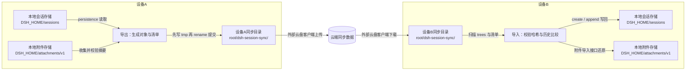
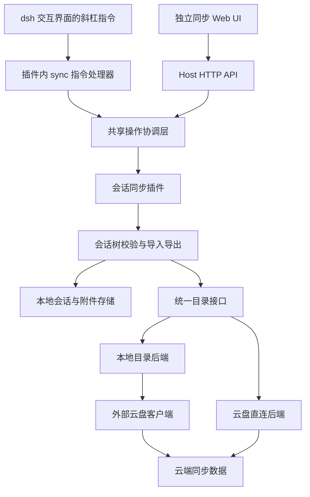
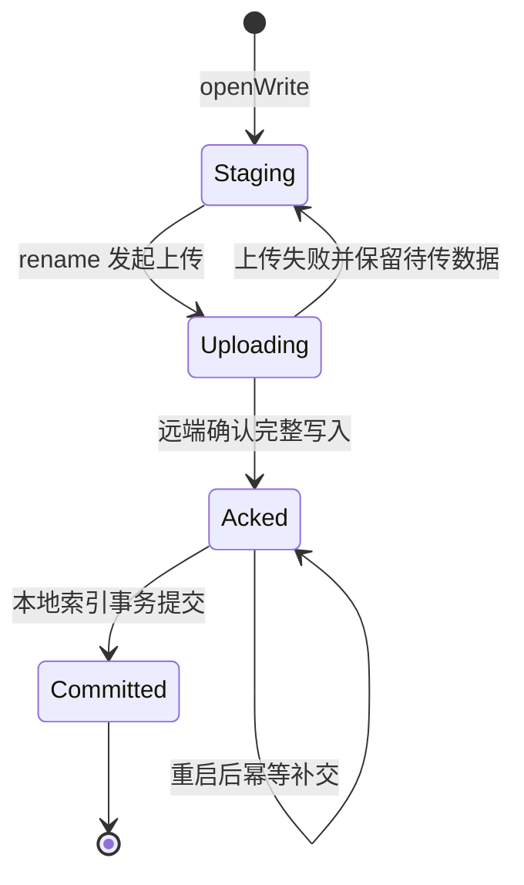
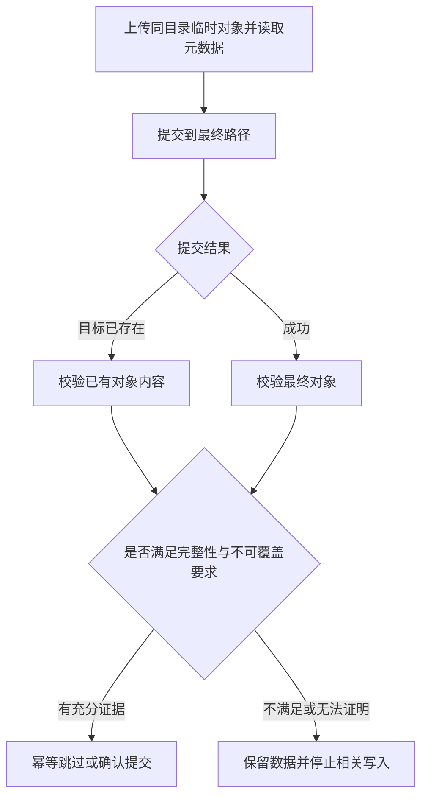
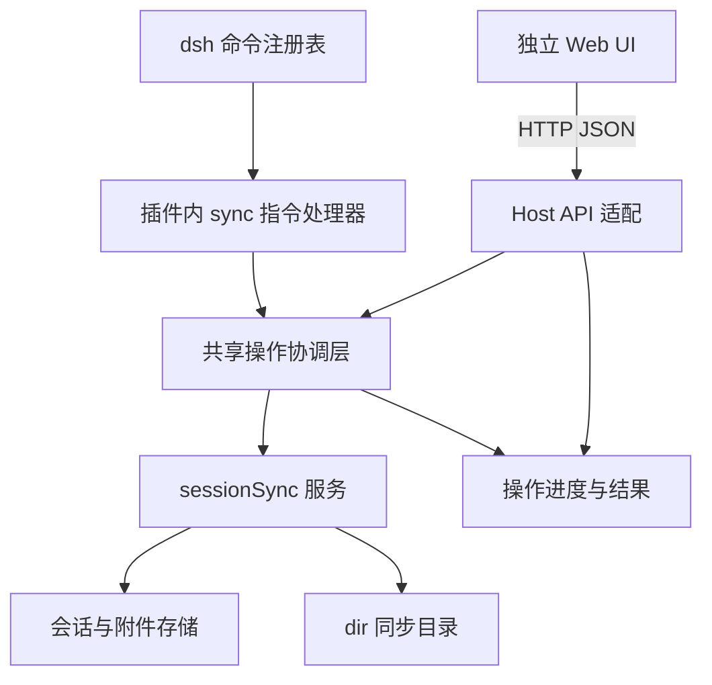
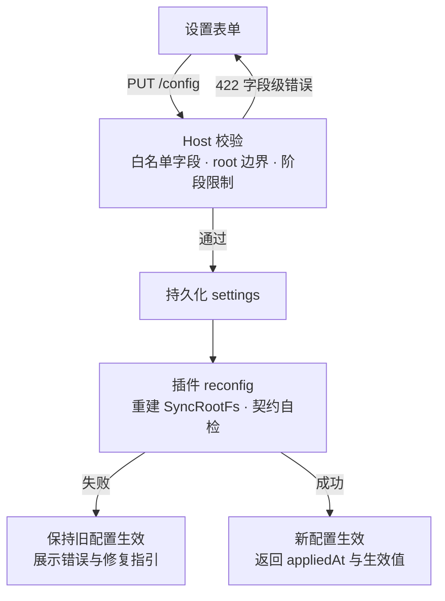

# Session 跨设备同步方案

> 状态：Draft · 评审稿（结构重构版）  
> 一句话目标：让用户通过云盘，把一台设备上的会话历史、子会话和附件传到另一台设备，在工作目录条件满足时继续使用。  
> 首阶段交付：仅实现 `dir` 同步目录后端；同时提供 dsh 斜杠指令和独立 Web UI，均覆盖导出、导入、状态查询。  
> 核心限制：会话同步不包含项目文件和运行现场；路径不匹配时，可能只能查看历史。

**阅读路线**：评审者先读[主文 1–8](#overview)；开发者按需查阅[技术附录](#technical)。本文按最新要求将独立 Web UI 纳入阶段 1，保留原方案的核心同步方向，并将实现细节、待决策事项与未验证假设分开说明。本文没有重新核验 Harness 仓库或厂商 API。

<a id="overview"></a>

## 1. 方案摘要：解决什么问题

用户在设备 A 上完成一段 Agent 对话后，希望在设备 B 上看到同一段历史，包括子 Agent 的会话和被引用的附件。当前方案拟增加独立的 `@deepseek-ai/dsh-session-sync` 插件，通过用户选择的云盘传输会话数据。

系统以“根会话 + 所有子会话 + 附件”为一个导出单元，生成带版本清单的同步包。另一台设备先检查数据是否完整，再决定新建会话、追加新历史、跳过重复数据或报告冲突。

必须区分两个结果：

| 用户期望 | 本方案的能力边界 |
|---|---|
| 在另一台设备查看历史 | 导入完整数据后，可以查看对话、子会话和附件；原文所述列表可见性仍需实现验证 |
| 在另一台设备继续运行 Agent | 还需要本地项目文件、可用的工作目录以及相关运行环境；同步会话本身不保证这些条件成立 |
| 恢复原设备正在执行的任务 | 不恢复终端、进程、任务队列、审批状态或运行现场 |
| 两台设备同时编辑同一会话 | 可以各自产生历史；发生分叉后报告冲突，不自动合并 |

首阶段仅使用 `dir` 后端，由用户已经安装的云盘客户端完成文件传输。用户可在 dsh 交互界面使用插件注册的 `/sync` 斜杠指令，或打开独立的同步管理 Web UI；该 Web UI 不依赖 DeepSeek Harness Web UI 的页面、路由或聊天上下文，但仍连接加载了 `dsh-session-sync` 插件的 Host。后续增加内置云盘连接，使用户无需额外安装客户端；两种方式共用同一套会话导入、导出逻辑。

## 2. 使用流程：用户如何完成一次跨设备迁移

### 2.1 正常流程

1. **配置同步位置**：两台设备分别选择指向同一份云端数据的本地同步目录。
2. **设备 A 导出**：用户在 dsh 交互界面输入 `/sync export`，或在独立 Web UI 中选择根会话并点击“导出”，系统保存内存中的最新事件，收集根会话、子会话和附件，生成同步包。
3. **云盘传输**：外部云盘客户端把文件传到设备 B。导出完成只代表源端已完成发布，不代表另一台设备已经收到全部数据。
4. **设备 B 导入**：用户在 dsh 交互界面输入 `/sync import`，或在独立 Web UI 中点击“扫描并导入”，系统先校验会话清单、事件和附件，再与本地历史比较。
5. **展示结果**：符合条件的会话写入本地；工作目录匹配时绑定工作区，否则展示为未分组并提示路径问题。
6. **继续使用**：用户确认项目文件和运行环境就绪后继续对话。后续再把新历史导出、传回另一台设备。

### 2.2 导入时会发生什么

| 遇到的情况 | 系统动作 | 用户看到的结果 |
|---|---|---|
| 本地还没有这个会话，远端数据完整 | 新建会话并恢复附件、父子关系 | 已导入 |
| 远端比本地多出一段连续历史 | 追加远端新增事件 | 已更新 |
| 本地与远端相同，或本地已经领先 | 不重复写入，不回退本地历史 | 无需更新 |
| 清单已到，但部分文件尚未到齐 | 本轮不导入，保留待处理状态 | 等待数据同步完成 |
| 数据摘要或格式不合法 | 拒绝导入并报告原因 | 校验失败 |
| 两端各自产生不同的新历史 | 默认不写入冲突数据，保留远端版本并记录报告 | 需要处理冲突 |
| 本地会话仍在运行，无法安全写入 | 返回忙碌状态，稍后重试 | 请先停稳会话 |
| 原工作目录在目标设备不存在 | 保留历史，提示无法绑定原工作区 | 可查看历史；继续运行受限 |

“等待到齐”和“校验失败”应使用不同提示，避免把正常的传输延迟误报为数据损坏。

### 2.3 涉及的目录与数据流转

一次跨设备迁移涉及三类目录，它们互不相同，也不能互相重叠（`root` 的边界校验见附录 B.1）：

| 目录 | 由谁决定 | 典型位置 | 存放什么 | 是否参与同步 |
|---|---|---|---|---|
| 本地会话与附件存储 | Harness 固定行为 | `<DSH_HOME>/sessions`、`<DSH_HOME>/attachments/v1/{objects,file-objects,files}` | 会话日志（append-only JSONL，默认 zstd 压缩）与附件对象 | 不同步；数据从这里导出，导入的数据写回这里 |
| 本地同步目录（插件配置 `root`） | 用户在设置页指定 | 如 `~/Dropbox/DSH Sync` | 同步包：`dsh-session-sync/{objects,sessions,trees,tmp}`（结构见附录 C） | 同步；由外部云盘客户端把它与云端保持一致 |
| 云端同步数据 | 外部云盘服务 | 云盘账户中的远端目录 | 与本地同步目录相同的内容 | 中转；本插件不直接读写（阶段 1），由云盘客户端上传下载 |

`DSH_HOME` 是 Harness 的数据根目录，解析顺序为：显式配置 → `$DSH_HOME` 环境变量 → 默认 `~/.dsh`。**会话日志与附件不出现在同步目录中，同步目录里也没有项目源码**——同步包是从本地存储*生成*的逻辑快照，不是存储文件的复制；`root` 与 `$DSH_HOME/sessions`、attachment 根重叠会被配置校验拒绝。

一次导出—传输—导入的完整数据流如下：



图中未出现的流转同样重要：**项目源码与工作区文件**（用户自行准备，见 §1 能力边界）、**派生数据**（搜索索引、投影缓存，导入后在设备 B 重建，见附录 D.2.6）、**运行现场**（终端、进程、审批状态，不迁移）都不经过这条链路。设备 A 的同步目录写完后，何时出现在设备 B 取决于云盘客户端，导出完成不代表对端已到齐（§2.1 第 3 步）。

## 3. 交付范围：本次做什么，后续做什么

### 3.1 首阶段范围

首阶段交付独立插件、同步包格式、`dir` 后端、dsh 斜杠指令、独立 Web UI，以及连接 Web UI 与插件服务的 Host API。生产配置仅支持 `dir`，`cloud` 留待阶段 2。Web UI 至少覆盖导出、导入、状态查询与配置查看、编辑，并提供根会话选择、任务进度和操作结果。导出默认以完整会话树为单位。首阶段必须具备重复导入幂等、分叉拒绝写入、缺件拒绝导入的基础能力；“双向与自动同步”阶段不意味着这些保护可以推迟。

| 数据或能力 | 首阶段处理 |
|---|---|
| 操作入口 | 同时交付 dsh 斜杠指令与独立 Web UI，三项核心操作语义一致 |
| Web UI 通信 | 同源 Host HTTP API；任务提交、结果查询与配置读写，复用插件服务 |
| 生产存储后端 | 仅 `dir`；页面展示并允许修改已配置目录与选择范围，不提供云盘授权入口 |
| 会话标识、头信息、完整事件与序号 | 保留；通过持久化 API 读取和写入 |
| 父子会话关系、继承事件计数 | 保留并校验 |
| 图片及通用文件附件 | 单独收集、传输、校验和恢复 |
| 工作目录 `cwd` | 原样保留；不自动改写为目标设备路径 |
| 项目源码及其他工作区文件 | 不同步；由用户另行准备 |
| 终端、进程、运行任务、审批状态 | 不同步 |
| 搜索索引、投影缓存等派生数据 | 不同步；导入后由本地重建 |
| 自动导入、自动导出 | 首阶段不默认启用 |
| 内置云盘授权和厂商 API 直连 | 后续阶段 |
| 端到端加密、自动清理旧版本 | 首阶段不交付 |

### 3.2 首阶段验收标准

1. A 导出的根会话、子会话和附件能在 B 完整导入，逻辑事件与附件摘要一致。
2. 同一同步包重复导入，不产生重复会话或重复事件。
3. 文件尚未到齐或校验失败时，不开始写入该会话树。
4. 本地历史领先时不回退；历史分叉时不自动拼接、不覆盖本地历史。
5. 独立 Web UI 无需打开 Harness Web UI 即可列出根会话、导出、导入、查询状态，并自动刷新本次操作结果；导入会话在 Harness 既有界面中的可见性也须验证，Harness 列表的实时推送刷新可在阶段 3 完成。
6. 工作目录不匹配、会话忙碌、校验失败和冲突均给出明确状态。
7. dsh 斜杠指令与 Web UI 使用同一服务和协调规则，给定相同源快照时两种入口的业务结果一致（命令生命周期日志的差异见附录 H.1.1）；刷新页面、重复点击或两个入口同时提交不会绕过幂等与互斥约束。
8. API 校验调用身份、来源及输入；未授权请求不能读写会话，导入导出请求不能指定任意 Host 文件路径。Host 不可达时页面给出连接提示，不误报同步成功。
9. Web UI 可查看并修改插件配置（`backend`、`root`、`selection.mode` 等，见附录 H.1.6）：保存由 Host 校验并持久化到同一配置来源；root 非法或与存储路径重叠、阶段不支持的后端等被拒绝并给出原因；修改只影响之后受理的操作，进行中的任务不受影响。

这里的“先校验后写入”不等于已实现整棵树的事务回滚。写入中断后的恢复、部分导入状态与验收方式，属于主文第 8 节列出的待澄清事项。

## 4. 总体设计：谁负责会话，谁负责传输

**核心决定：会话插件负责数据语义，后端负责存储与传输，双方通过统一的目录接口连接。** 这样增加云盘服务时，不必改动会话导入、导出的主体逻辑。



| 组成部分 | 负责什么 | 不承担什么 |
|---|---|---|
| 独立 Web UI | 会话选择、同步操作、进度与结果展示、配置查看与编辑 | 不依赖 Harness Web UI，不直接访问 Host 文件系统；配置值一律经 Host 校验后生效 |
| Host HTTP API 与插件共享操作协调层 | 身份校验、参数转换、任务登记、斜杠指令/Web UI 统一互斥和结果查询 | 不复制会话导入导出算法 |
| 会话同步插件 | 收集会话树、生成同步包、完整性校验、历史比较、导入和冲突报告 | 不直接调用厂商 API，不保管云盘凭据 |
| 统一目录接口 `SyncRootFs` | 定义读取、写入、列举、提交等行为及其保证 | 不理解对话、事件或工作区 |
| 本地目录后端 `dir` | 使用本地文件系统实现目录接口 | 不替用户配置或运行云盘客户端 |
| 云盘直连后端 `cloud` | 授权、远端读写、待上传数据保存、远端变更发现 | 不判断两段会话历史能否合并 |

**独立界面的部署建议**：前端单独构建，拥有独立页面入口；阶段 1 建议由 Host 的本机 HTTP 服务同时提供静态页面与 API，使二者同源。它仍是独立于 Harness Web UI 的前端应用，无需额外引入一个业务后端进程。Host 的路由、认证和静态资源承载能力需对照实际仓库确认。通信协议见附录 H.1.3–H.1.5。

两种生产后端的选择：

| 方式 | 适用场景 | 主要代价 | 阶段 |
|---|---|---|---|
| 本地目录 + 已有云盘客户端 | 用户已有同步工具，希望先用起来 | 依赖外部客户端的延迟、冲突副本和同步规则 | 阶段 1 |
| 内置云盘连接 | 用户希望在 Harness 内完成连接与同步 | 需要维护凭据、上传日志、远端发现和厂商适配 | 阶段 2 |

首版不引入操作系统文件系统挂载组件。目录接口的完整定义与后端选择依据见[附录 B](#appendix-b)。

## 5. 关键决策：为何这样设计

| 决策 | 要解决的问题 | 实现方式 | 代价或限制 |
|---|---|---|---|
| 独立 Web UI 与插件斜杠指令共用 Host 服务 | 提供独立图形入口并保持结果一致 | HTTP API 转接 `ctx.sessionSync`；操作协调在 Host 侧共享 | 新增接口、任务状态与本机访问控制 |
| 导出逻辑会话树 | 物理日志格式与附件位置不适合作为跨设备协议 | 经持久化 API 读取事件，另行收集附件和父子关系 | 需要独立同步包格式 |
| 使用不可变版本与内容摘要 | 文件可能重复传输、延迟到达或损坏 | 对象按内容摘要命名，版本清单最后发布，导入前校验所有引用 | 历史版本会增长，后续需要保留策略 |
| 导入时比较会话历史 | 两端可能各自产生新事件 | 相同则跳过，单向延长则追加，分叉则报告 | 冲突在导入时发现，不能提前阻止并发写入 |
| 首版保留原工作目录 | 现有头信息不可变，路径又参与存储与工作区身份判断 | `cwdPolicy: preserve` | 不同设备路径不一致时，继续运行受限 |
| 将厂商能力封装在后端 | 避免导入导出逻辑绑定某家云盘 | 插件只依赖目录接口及契约 | 必须验证后端能兑现契约，不能只声明支持 |
| 云盘直连首版运行于 Harness 进程内 | 减少进程、IPC 和生命周期管理 | 后台任务配合索引与上传日志 | 云盘凭据会进入 Harness 进程内存 |
| Web UI 内编辑同步配置 | 用户无需手改 YAML 即可调整同步目录与选择范围 | Host 校验 + settings 持久化 + reconfig 生效（附录 H.1.6） | 需配置读写接口与生效语义；非法值由 Host 拒绝而非浏览器决断 |

### 5.1 冲突与契约违约分别由谁处理

原文中“不做冲突检测”的说法统一限定为：**不在云盘后端实现基于同步基线的多设备历史仲裁。** 它不取消插件侧的历史比较，也不取消后端的完整性和不可覆盖检查。

| 类别 | 示例 | 责任方 |
|---|---|---|
| 存储操作冲突 | 同一路径已有不同内容、条件写失败、客户端生成冲突副本 | 后端转述厂商结果或保留客户端产物；插件按内容校验 |
| 会话历史分叉 | A、B 从同一基线分别追加了不同事件 | 插件在导入计划中比较本地与远端历史，默认隔离并报告 |
| 后端契约违约 | 已提交路径出现不完整内容、不可变对象被覆盖 | 后端检测与插件校验共同防护；发现后停止相关写入并报错 |

内容摘要可以帮助校验完整性，不能证明数据来源可信；本地索引事务的保证范围也必须与其他设备观察到的远端状态区分，见第 8 节。

## 6. 主要限制与用户可见行为

| 限制或风险 | 对用户的影响 | 本方案的处理 |
|---|---|---|
| 工作目录跨设备不一致 | 能读历史，但可能无法继续运行 Agent | 首页与导入结果明确提示；路径重绑定另行设计 |
| 云盘传输延迟 | 导出后，另一台设备暂时导入不了 | 显示待同步状态，允许重试，不做缺件导入 |
| 多设备并发编辑 | 产生无法自动合并的历史分叉 | 保留版本，默认不覆盖本地历史，报告冲突 |
| 云盘直连的待上传日志丢失 | 尚未上传的数据可能无法恢复 | 将上传日志作为持久状态，丢失时显式报错 |
| 会话包含敏感内容 | 对话、工具参数、文件摘要可能进入云盘 | 显式启用同步；凭据不写配置或日志；首版无端到端加密 |
| 后端未满足目录契约 | 可能出现不完整读、漏发现或覆盖 | 契约测试及运行时检查；缺少必需保证时拒绝使用 |
| 大附件或全树扫描成本 | 超出上传限制，或同步延迟较高 | 明确报错；分块、缓存和扫描优化按后续实测决定 |

设置页应展示连接状态、同步进度、失败原因和恢复操作。索引或上传日志等实现术语仅在诊断信息中展开。

## 7. 实施计划：每阶段交付什么结果

阶段编号在本文中统一使用 1–5。阶段 2 的适配器开发可与阶段 1 并行探索，但端到端验收依赖阶段 1 的插件、格式和契约稳定。

| 阶段 | 用户获得的能力 | 主要工作 | 阶段验收 |
|---|---|---|---|
| 1 · dsh 斜杠指令与独立 Web UI | 用已有云盘通过 dsh 斜杠指令或独立页面导出、导入、查询状态、调整同步配置 | 独立插件；仅 `dir` 生产后端；格式 v1；会话树与附件；Host API；会话选择；配置查看与编辑；共享任务协调；基础访问控制 | 满足第 3.2 节全部标准；独立页面无需 Harness Web UI 即可完成导出、导入、状态查询与配置修改，业务结果与 dsh 斜杠指令一致 |
| 2 · 内置云盘连接 | 不安装云盘客户端也能完成同样的迁移 | 单个服务适配；适用的授权方式；索引与上传日志；连接及恢复命令 | 通过相同契约测试；跨设备端到端导入结果与 `dir` 一致；首个适配服务待决策 |
| 3 · 工作区与界面增强 | 完善工作区体验，并可从 Harness Web UI 进入同步管理 | 完善绑定；Harness 会话列表推送刷新；可选入口链接；增强冲突处置与设置 | 独立 Web UI 保持可单独使用；Harness 列表无需手动刷新即可看到变化 |
| 4 · 自动双向流转 | 减少手动操作，持续发现与传输新版本 | 导入导出进度记录；启动扫描；空闲导出；冲突报告；显式版本清理命令 | A 导出、B 导入续写、A 再导入可完整往返；分叉仍不自动合并 |
| 5 · 性能与覆盖扩展 | 更低传输成本，更多服务和路径适配能力 | 事件分块；对象复用优化；更多适配器；缓存；路径重绑定研究；可选端到端加密 | 性能指标由实测后确定；路径策略完成单向/双向兼容性验证 |

附件在格式层已经按摘要存放；阶段 5 的对象复用是优化其使用效率，不是到阶段 5 才具备完整性校验。游标增量只适用于支持此能力的服务，不能把它作为所有 WebDAV 服务的统一验收条件。

## 8. 本轮评审需要明确的事项

### 8.1 范围与实施决策

| 编号 | 需要决定什么 | 当前建议或现状 | 对交付的影响 |
|---|---|---|---|
| R1 | 是否接受首阶段以历史迁移为核心，路径匹配时才可继续运行 | 保留原方案的 `preserve` 路线 | 如要求任意设备无缝续用，需提前解决项目文件和路径身份问题 |
| R2 | 阶段 2 首个服务选 WebDAV 还是 Dropbox | 原文标题与正文冲突；本次不代替评审选择 | 决定授权方式、远端提交机制和测试环境 |
| R3 | 首阶段工作区绑定与 Harness 列表集成的最低要求 | 独立 Web UI 及其状态刷新已确定为阶段 1 必需；Harness 列表推送刷新在阶段 3 | 确保独立页面可选择会话、查看操作结果，并验证 Harness 基础可见性 |
| R4 | 附件恢复是否新增正式导入接口 | 原文建议新增，仍保留 fallback | 需确认依赖方支持及引用一致性验收 |

### 8.2 实现前必须澄清的技术表述

以下事项来自原文中的保证范围或口径不一致。本次将其显式列出，未把待验证假设改写成已实现能力。

| 编号 | 需澄清的问题 | 需要补齐的结论 |
|---|---|---|
| T1 | 对象型云盘后端用本地索引事务作为提交点 | 本端可见性与跨设备远端可见性分别由什么保证；本地事务不能单独作为全局原子性的证明 |
| T2 | WebDAV 以 ETag 对比判断内容相同及不可覆盖 | 哪些服务满足所需语义；写后检查能证明什么；还需哪些防覆盖条件与测试 |
| T3 | 目录契约 C5 同时涉及条目完整性与枚举不漏项 | 分开定义“返回条目可读”和“已提交对象最终可发现”，明确分页与延迟边界 |
| T4 | 导入前全量校验，但写入按会话、按事件批次执行 | 中途失败如何恢复、如何报告部分导入；是否需要树级事务，当前原文尚未明确 |
| T5 | WebDAV 适配引用的服务特定行为被用于介绍多种 WebDAV 服务 | 接口文档与其实现映射见 `clouds/WebDAV.md`；分页、锁、MOVE、属性行为不能未经验证推广到所有服务 |
| T6 | WebDAV 超限正文与错误码表的映射不一致 | 统一超限错误为一个对外语义，并补全错误码定义与测试 |
| T7 | 部分契约测试期望仅靠插件发现目录漏项或远端覆盖 | 明确测试观测点及证据；契约声明、自检和插件校验各自能发现什么 |
| T8 | WebDAV 凭据撤销与 OAuth 通用退出流程混写 | 按服务能力说明远端撤销和本地清除；不能把某种授权模型的操作视为所有服务通用 |

**已确定的新增范围**：阶段 1 同时交付 dsh 斜杠指令与独立 Web UI，且仅支持 `dir` 生产后端。待实现核对的是 Host 的 HTTP 路由与认证承载方式，不再将“是否做独立 Web UI”列为开放问题。

首个适配服务选定后，应重新核对授权、配额、条件写和远端提交语义。其余开放问题按主题保留在[附录 J](#appendix-j)。

<a id="technical"></a>

## 技术附录导航

附录保留开发所需的接口、格式、算法、配置和测试。主文统一解释范围和术语；标为“待核验”的原有假设不构成已验证的实现保证。

| 附录 | 内容 | 适用读者 |
|---|---|---|
| [A](#appendix-a) | 现有代码约束 | 核心存储、工作区开发者 |
| [B](#appendix-b) | 插件接口、目录契约和后端选择 | 插件与后端开发者 |
| [C](#appendix-c) | 同步包目录与清单格式 | 序列化和兼容性开发者 |
| [D](#appendix-d) | 导出、导入、附件恢复和刷新 | 导入导出开发者 |
| [E](#appendix-e) | 冲突规则和路径策略 | 数据一致性与工作区开发者 |
| [F](#appendix-f) | 云盘直连通用机制 | 云盘后端开发者 |
| [G](#appendix-g) | WebDAV 服务适配草案 | WebDAV 适配开发者 |
| [H](#appendix-h) | 命令、界面、安全与错误码 | 客户端与集成开发者 |
| [I](#appendix-i) | 测试与故障注入清单 | 开发与测试人员 |
| [J](#appendix-j) | 开放问题与重构记录 | 评审与项目负责人 |

### 术语速查

| 术语 | 本文含义 |
|---|---|
| 会话树 | 一个根 Session 及其所有后代 Session |
| 同步包（bundle） | 逻辑上关联的一组事件对象、附件与版本清单，不是单个 ZIP 文件 |
| 版本清单（manifest） | 描述某个会话版本或整棵会话树引用哪些数据的文件 |
| 内容寻址 | 使用内容摘要生成对象路径，相同字节可以复用同一对象 |
| 目录契约 | 后端必须提供的读取、提交、不可覆盖和发现保证 |
| 保守拒绝（fail-closed） | 无法确认数据有效或后端满足要求时，停止相关操作并报告原因 |
| 追加更新（fast-forward） | 本地历史完整地位于远端历史开头，只追加远端多出的事件 |
| 隔离（quarantine） | 默认不写入冲突数据，记录冲突报告，保留远端版本；不隐含已实现独立隔离存储区 |
| 索引（index） | 云盘后端保存的对象状态与远端元数据 |
| 上传日志（journal） | 保存尚未完成上传的本地数据和恢复信息 |
| `cwd` | 会话原工作目录；与云盘同步目录、远端存储路径是不同概念 |
| `DSH_HOME` | Harness 数据根目录；显式配置 → `$DSH_HOME` 环境变量 → 默认 `~/.dsh`。会话日志与附件存储都位于其下 |
| 本地同步目录 | 插件配置 `root` 指向的本机目录，存放同步包并由外部云盘客户端与云端保持一致；与会话存储、附件存储互不重叠 |

---


<a id="appendix-a"></a>

## A 现有代码约束

以下为原方案记录的代码约束，本次结构重构未重新检查仓库；实现前应对照当前代码复核。

1. Session 日志是 append-only 的物理存储。
   - 逻辑读取通过 `SessionPersistence.open(id, 'read'|'write')` 和 `SessionHandle`；
   - header 一旦创建不可变；
   - `cwd` 同时决定物理存储路径和 Workspace 归属校验；
   - 生产组合把持久化根固定为 `<DSH_HOME>/sessions`（`DSH_HOME` 解析顺序见术语速查），目录内按归一化 `cwd` 与 Session id 分层（`dsh-session-persistence-jsonl`）。

2. `cwd` 是 UI 可见性的关键字段。
   - `ApiSessionList.list()` 会跳过 `cwd === undefined` 的 cold Session；
   - `SessionHistoryController.sourceFor()` 也会拒绝 `cwd === undefined` 的 Session；
   - 因此导出包必须保留有值的 `cwd`，导入也必须写回有值的 `cwd`。

3. Workspace 归属是显式账本。
   - `WorkspaceRegistry` 保存 `sessionIds`；
   - 成员资格要求 `realpath(header.cwd) === workspace.path`，且目录存在；
   - 首次初始化 Workspace 域时会按 cwd bootstrap，之后不会自动把新 Session 追加进已有 Workspace；
   - 导入如果需要分组，必须显式调用 `workspace.attachSession(sessionId)`。

4. 附件不在 Session 日志里。
   - Session 事件只包含 `ImageAttachmentRef` / `FileAttachmentRef`；
   - 图片字节在 `<DSH_HOME>/attachments/v1/objects/...`；
   - 通用文件字节在 `<DSH_HOME>/attachments/v1/file-objects/...`，引用路径在 `<DSH_HOME>/attachments/v1/files/...`；
   - 同步包必须单独携带附件对象。

5. 子 Session 默认不出现在顶层列表。
   - `origin: 'subagent'` 的行由 `ui-workspace` 隐藏；
   - 子 Session 通过父 Session 的 catalog 进入；
   - 同步应以根 Session 为单位导出整棵树，而不是只导一个子 Session。

6. live Session 导出前必须 flush。
   - 与 `dsh-session-log-export` 一样，先通过 `ctx.sessions.get(id)` + `sessions.flush(session)` 把内存事件刷到持久化，再用 read handle 读取。

7. 派生数据可以重建，不应同步。
   - projection cache、SQLite 全文索引、request-image 缓存都可以在导入后按需重建。

---

<a id="appendix-b"></a>

## B 插件接口、目录契约与后端选择

统一目录接口是插件与后端的实现边界。声明、运行时检查和一致性测试应分别验证，详见主文 T1–T3、T7。各 `cloud` 后端的设计文档位于仓库子目录 [`clouds/`](./clouds/index.md)（现阶段仅 WebDAV 设计稿，代码实现随对应阶段交付）；本附录给出契约与选型依据，不维护逐文件清单。

### B.1 session-sync 插件

建议新增 Host-only 插件包：

```text
packages/session/session-sync/
  src/
    index.ts          # Cordis 插件入口、ctx.sessionSync 服务
    commands.ts       # 插件内注册 /sync，解析 export/import/status；无独立 CLI
    http.ts           # 独立 Web UI 的 Host HTTP 接口适配（路由 API 待核对）
    operations.ts     # 两种入口共用的任务协调、幂等与状态记录
    bundle.ts         # manifest 读写与校验
    export.ts         # 导出算法
    import.ts         # 导入算法
    attachments.ts    # 附件收集与还原
    conflicts.ts      # 前缀比较、冲突分类（插件侧判定；后端层冲突由同步层给出）
```

服务依赖：

```ts
export const inject = [
  'sessionPersistence',
  'sessions',
  'sessionQuery',
  'attachments',
  'workspaceRegistry',
]
```

入口适配与依赖：

- `dsh-session-sync` 插件内的 `commands.ts` 通过 `ctx.commands.register()` 注册一个名为 `sync` 的 dsh 宿主侧斜杠指令，自行解析 `export`、`import`、`status` 子命令；这是阶段 1 必需交付，注册 API 依据用户提供的 `SLASH_COMMANDS.zh.md`。
- HTTP 适配使用 Host 路由和认证能力，提供独立 Web UI 的 API。具体注入服务名需检查仓库，本文不假定已有可复用路由。
- dsh 斜杠指令与 HTTP 共用 Host 操作协调层，再调用下述 `SessionSyncService`；协调层负责重复请求、排队、进度和操作结果。
- 独立 Web UI 建议单独前端包构建；Host 静态资源适配与 HTTP 路由可放在独立适配模块，保持同步核心不依赖浏览器。
- 配置的查看与编辑属于阶段 1 独立 Web UI 的设置模块（附录 H.1.6）：读取与写入来自同一 `settings` 来源，由 Host 校验并持久化；阶段 1 可编辑 `backend`（仅 `dir`）、`root`、`selection.mode`、`selection.includeArchived`，其余字段只读展示。
- 首阶段独立 Web UI 不依赖 Harness Web UI 的 `connection` / `remote` 前端通信上下文。
- 命令注册分支使用 `ctx.inject(['commands'], ...)` 条件装配：有命令服务的交互组合必须注册 `/sync`；无命令适配器的 headless 组合仍可运行同步核心和 HTTP API。不要把 `commands` 加入核心服务的硬依赖并导致 Web UI 无法启动。
- 同步命令按 Host 插件的全局作用域注册一次，不在每个 agent 上重复注册；插件卸载时通过注册返回的 disposer 注销，避免热重载重复定义。

核心服务接口（进程内接口，不直接暴露为浏览器可调用对象）：

```ts
interface SessionSyncService {
  export(request: SessionSyncExportRequest): Promise<SessionSyncExportResult>
  import(request: SessionSyncImportRequest): Promise<SessionSyncImportResult>
  scan(signal?: AbortSignal): Promise<SessionSyncStatus>
}
```

目录访问抽象：插件不得直接 `import node:fs`，所有目录访问都走一个可注入的窄接口。有了这层抽象，附录 B.3 的契约才能被替换实现（测试尤其需要），也才能在运行时自检：

```ts
interface SyncRootFs {
  readonly kind: 'dir' | 'cloud'
  readonly declaredContract: readonly SyncRootClause[]   // 声明满足哪些条款，见附录 B.3

  stat(path: string): Promise<Stats | undefined>
  readdir(path: string, opts: { recursive: boolean }): AsyncIterable<DirEntry>
  openRead(path: string): Promise<ReadStream>
  openWrite(path: string): Promise<WriteStream>          // 写 tmp 用
  rename(from: string, to: string): Promise<void>        // 提交点
  unlink(path: string): Promise<void>
  fsync(path: string): Promise<void>
  mkdir(path: string, opts: { recursive: boolean }): Promise<void>
}

interface SyncRootFsFactory {
  create(config: { root: string; kind: 'dir' | 'cloud' }): Promise<SyncRootFs>
}
```

- `kind: 'dir'`：默认实现，基于 `node:fs/promises`；
- `kind: 'cloud'`：阶段 2 的云厂商 API 直连，见附录 F；阶段 1 生产配置须拒绝该值，不能自动退回 `dir`；
- 插件在 `scan()` 时把 `declaredContract` 与附录 B.3 的必需条款取交集，缺一条就 fail-closed 并报 `SYNC_ROOT_CONTRACT_UNMET`。

配置示例（保留长期字段；阶段 1 仅允许 `backend: dir`、`cwdPolicy: preserve`，自动触发关闭）：

```yaml
- name: '@deepseek-ai/dsh-session-sync'
  config:
    backend: dir                    # 阶段 1 仅 dir；cloud 为后续能力
    root: ~/Dropbox/DSH Sync        # backend: dir 时的本地目录；建议显式配置
    selection:
      mode: session-tree            # session-tree | all-ordinary
      includeArchived: false
    cwdPolicy: preserve             # preserve | remap
    conflictPolicy: quarantine      # quarantine | keep-local
    importOnStartup: false
    exportOnIdle: false
```

配置校验必须拒绝：

- `root` 为空，且 `backend: dir`；
- `root` 与 `sessionPersistence.root` 重叠；
- `root` 位于任意 attachment root 内；
- `root` 位于 `$DSH_HOME/sessions` 内。

`backend: dir` 时 `root` 必须是本机可访问的路径。`backend: cloud` 时 `root` 不参与配置：远端路径与状态目录属于 `cloud` 后端的配置（附录 F.11），插件的配置里看不到厂商侧路径，也拒绝接受。

#### B.1.1 附录实现索引

各 `cloud` 后端的设计文档存放在子目录 [`clouds/`](./clouds/index.md)；现阶段（阶段 1）仅保留设计稿，不包含可运行实现：

| 内容 | 位置 | 依据 |
|---|---|---|
| WebDAV 适配设计稿：`SyncProvider`（附录 F.7）实现映射、`SyncRootFs` 组合、提交协议、错误映射、陷阱、测试计划与实现前缺口 | `clouds/WebDAV.md` | 附录 F.7 / G，接口依据见该文档 |

后端 `dir` 的设计已由本附录 B.2 / B.3 完整覆盖（本地文件系统语义直读），无需单独文档。各后端的代码实现随对应阶段交付；阶段 1 生产配置仅允许 `backend: dir`，`kind: 'cloud'` 在实现落地并通过契约测试前由配置校验拒绝。设计稿的提交协议含「提交前探针」（目标已存在：同内容幂等跳过 / 异内容 `SYNC_REMOTE_CONFLICT`，双方保留），是对附录 G.5 草案的强化。

### B.2 后端 `dir`：本地目录（外部云盘客户端填充）

`SyncRootFs` 的最简实现：`kind: 'dir'`，直接落在 `node:fs/promises` 上，`<syncRoot>` 是一个普通本地目录。

- 谁把目录同步到别的设备：用户自备的 Dropbox / OneDrive / Google Drive / iCloud 桌面客户端；
- 本功能不参与、不检测、不配置；
- 优点：零凭据、零 API 成本、天然跨平台、离线可用，用户可以直接用 Finder 查看和抢救数据；
- 代价：客户端风格的文件名改写（`conflicted copy`）、延迟到达、半同步、客户端自身的 include/exclude 规则。

这是现状基线：即使后端 `cloud` 完全没做，session-sync 也必须可用。


### B.3 同步根文件系统契约（SyncRootContract）

无论 `<syncRoot>` 是本地目录还是云厂商 API 支撑的虚拟目录，插件都只依赖下面这份契约。契约先于实现：没有这份契约，"用厂商 API 实现目录语义"就只是把失败从看得见变成静默。

| # | 条款 | 插件为何依赖 | 不满足时的症状 |
|---|---|---|---|
| C1 | read-your-writes：写入后立刻 `stat`/`open` 可读到该内容 | 附录 D.1.4 "已存在则校验哈希后跳过" | 重复上传、幂等失效 |
| C2 | rename 原子可见：`rename` 返回后，目标路径要么不存在，要么内容完整 | 附录 D.1.4 的提交点 | 读到半截 object → `SYNC_HASH_MISMATCH` |
| C3 | 存在 ⇒ 完整：最终路径上不出现内容不完整的文件 | 附录 D.2.1 的校验前提 | 假失败、bundle 被判 corrupt |
| C4 | 不变对象不被覆盖：`rename` 到已存在路径时失败或保持原内容 | 内容寻址去重 | 两设备互相覆盖 revision |
| C5 | readdir 完整：`readdir` 不返回不可读/不完整的条目 | 附录 D.2.1 扫描 | 随机漏 import |
| C6 | fsync 尽力而为：崩溃后最坏是丢文件，不是内容错位 | 允许远端延迟可见 | 保守实现会让每次 flush 卡住 |
| C7 | 不主动删除：不因远端缺失就 unlink 本地对象 | 附录 E.1 冲突隔离 | 静默丢历史 |
| C8 | 远端可见性：`readdir` 必须体现其他设备已提交的对象；允许延迟，延迟不算违约 | 跨设备发现 | 永远看不到别的设备导出的 Session |

- 必需：C1–C5、C7、C8。
- 弱保证即可：C6。
- 延迟是允许的，不完整是不允许的：C8 只要求最终可见，不要求即时；C3 一旦被违反（出现"存在但不完整"），插件将报错而非降级。

各后端的满足方式：

| 后端 | C1 / C2 | C3 | C5 | C8 |
|---|---|---|---|---|
| `dir` | 本地文件系统 | 本地文件系统 | 本地文件系统 | 依赖外部客户端，延迟可能很大 |
| `cloud`（对象型 provider，`local-index`） | 本地索引事务 | `index` 只 commit 已 ack 的对象 | 远端 listing + `index` 合并 | 远端 listing（cursor/delta） |
| `cloud`（WebDAV，`remote-move`，附录 G） | 服务端同父目录 `MOVE` 原子 | 服务端 `PUT`（强制 `Content-Length`）整体写入 | 逐层 `PROPFIND` + 必须跟随 `mk` 分页 | 逐层全量 `PROPFIND`，延迟 = 扫描间隔 |

两行 `cloud` 的差别本身就是结论：C2 / C3 的保证者从"我们自己的索引事务"换成了"服务端"。WebDAV 这一行更接近 `dir`，对象型 provider 那一行才是 附录 F.4 状态机真正要解决的问题域。C4 在 WebDAV 下拟依赖服务端防覆盖能力；附录 G.5 的检查草案及其证明范围须完成主文 T2 的验证后，才能作为能力声明依据。

> **待澄清 T3 / T7**：C5 的“完整”同时包含不漏项与条目可读两层含义；声明检查不等同于对运行时行为的证明，列举遗漏也不一定能仅靠插件已有信息检测。实现前需分别确定条款、测试观测点与运行时检查能力。

实现方必须显式声明满足哪些条款（`SyncRootFs.declaredContract`），插件在 `scan()` 时自检，缺失必需条款即 `SYNC_ROOT_CONTRACT_UNMET`，fail-closed。契约条款有一套一致性测试套件（附录 I），任何后端跑同一套测试。


### B.4 后端选型矩阵

| 后端 | 跨平台 | 持久 | 人类可见 / 可手工抢救 | 可被外部云盘客户端同步 | 需要凭据 | 定位 |
|---|---|---|---|---|---|---|
| `dir`（`node:fs/promises`） | 是 | 是 | 是 | 是 | 否 | 默认；生产基线 |
| `cloud`（厂商 API 直连） | 是（纯 TS） | 是（远端 + 本地 `index`/`journal`） | 无本地完整镜像；远端可浏览性取决于服务 | 否（会双写） | 是 | 免客户端场景 |

> 为什么不做内核挂载（FUSE / FSKit / File Provider）？挂载能把 C2 / C3 从"指望客户端碰巧做到"提升为"由 FS 实现保证"，看似更优雅，但代价是每个平台一套实现（macOS：macFUSE 需批准内核扩展，或 FSKit 需 15.4+，或 File Provider 扩展；Linux：FUSE；Windows：cldapi / WinFsp），第三方挂载的本地提交与远端提交保证需要分别验证，不能默认等价。
> 本设计拟使用附录 F 的进程内后端提供这些目录行为；其远端保证仍需按主文 T1 验证。这是本设计选择"进程内实现目录语义"而不是"挂载"的根本原因。


### B.5 与 `dsh-session-log-export` 的关系

不要直接依赖或复用 `@deepseek-ai/dsh-session-log-export`：

| 维度 | dsh-session-log-export | session-sync |
|---|---|---|
| 目标 | 浏览器下载 ZIP | 云盘目录长期同步 |
| 数据源 | Host 路由 + 浏览器触发 | Host 服务/命令 |
| 格式 | 一次性 ZIP | 版本化、内容寻址 bundle |
| 方向 | 只导出 | 导入 + 导出 |
| 冲突 | 不涉及 | 必须处理 |
| Workspace | 不涉及 | 必须处理绑定 |
| 派生数据 | 不涉及 | 明确不导出 |
| 传输 | HTTP `Response` | 目录语义（后端 `dir` / `cloud` 可插拔） |
| 凭据 | 无 | 插件不持有；`cloud` 后端经 OS credential store 持有 |

可以复用的只有底层概念：

- 通过 `sessionPersistence` 读句柄读取；
- 通过 `sessionQuery.traceSession` 拿谱系；
- 通过 `attachments.readImage` / `readFileStream` 拿附件；
- 通过 `sessions.flush` 保证 live Session 一致。

如果未来发现导出序列化代码重复，可以把这部分抽到一个更底层的公共库，而不是让 `session-sync` 依赖浏览器导出包。

---

<a id="appendix-c"></a>

## C 同步包目录与清单格式

云盘同步目录中建议采用内容寻址 + 不可变对象 + manifest 最后落盘的结构，而不是直接复制 `.jsonl.zstd`。

这个结构同时是给后端实现看的契约：只要求"目录语义 + rename 原子可见 + 已存在文件不被覆盖"（完整条款见附录 B.3）。因此无论目录由外部客户端同步（后端 `dir`）还是由厂商 API 直接支撑（后端 `cloud`），插件的行为完全一致。后端不需要理解下面任何一个目录的含义。

```text
<syncRoot>/
  dsh-session-sync/
    schema-version.json
    objects/
      events/
        <sha256>.jsonl
      attachments/
        <sha256>
    sessions/
      <sessionId>/
        revisions/
          <revisionHash>.json
    trees/
      <rootSessionId>/
        <treeRevisionHash>.json
    tmp/                         # 写入过程中使用，导入方忽略
```

### C.1 内容寻址对象

- `objects/events/<sha256>.jsonl`
  - 内容是规范化的当前格式事件行；
  - 每行一个 SessionEvent；
  - 对象内容不可变，路径由内容 SHA-256 决定；
  - 同一个事件块在多个 revision 之间自动去重；
  - 两个设备写同样内容会落到同一路径，云盘不会产生有效冲突。

- `objects/attachments/<sha256>`
  - 图片和通用文件都按字节 SHA-256 存放；
  - 引用方在 manifest 中声明该对象的 kind、bytes、mediaType、name；
  - 导入时重新计算摘要并校验。

### C.2 Session Revision Manifest

每个 Session 的每个导出快照写一个不可变 `revisions/<revisionHash>.json`：

```json
{
  "schema": 1,
  "sessionId": "session-...",
  "header": {
    "id": "session-...",
    "version": 3,
    "createdAt": 1730000000000,
    "cwd": "/Users/alice/project",
    "parentSession": null,
    "isSeeded": false,
    "delegationDepth": 0,
    "origin": null,
    "agentPreset": null
  },
  "headerSha256": "…",
  "inheritedEventCount": 0,
  "sourceFormatVersion": 3,
  "eventCount": 1234,
  "lastSeq": 1233,
  "previousRevision": "sha256:…",
  "segments": [
    {
      "startSeq": 0,
      "endSeq": 1234,
      "sha256": "…",
      "formatVersion": 3
    }
  ],
  "attachments": [
    {
      "kind": "image",
      "attachmentId": "sha256:…",
      "sha256": "…",
      "mediaType": "image/png"
    },
    {
      "kind": "file",
      "attachmentId": "sha256:…",
      "name": "report.csv",
      "bytes": 12345,
      "sha256": "…"
    }
  ],
  "source": {
    "deviceId": "…",
    "harnessVersion": "0.1.5",
    "exportedAt": "2026-09-24T00:00:00.000Z",
    "cwd": "/Users/alice/project"
  }
}
```

### C.3 Tree Manifest

一次导出的 Session 树写一个不可变 `trees/<rootSessionId>/<treeRevisionHash>.json`：

```json
{
  "schema": 1,
  "rootSessionId": "session-root",
  "exportedAt": "…",
  "workspaceHint": {
    "sourcePath": "/Users/alice/project",
    "title": "project"
  },
  "sessions": [
    {
      "sessionId": "session-root",
      "revision": "sha256:…",
      "parentSession": null,
      "origin": null
    },
    {
      "sessionId": "session-child",
      "revision": "sha256:…",
      "parentSession": "session-root",
      "origin": "subagent"
    }
  ]
}
```

导入方只需要扫描 `trees/**/*.json`，包括被云盘改成 conflict-copy 文件名的 manifest。不要依赖文件名，应该校验内部 JSON。

### C.4 为什么不用直接复制 Session 存储文件？

不能直接复制 `<DSH_HOME>/sessions`，因为：

- 默认 Web/base 使用 `compression: 'zstd'`；
- 物理 layout 是 `--project--/<encoded-id>/session.vN.jsonl.zstd`；
- 可能是旧 generation，需要迁移；
- 附件不在 sessions 目录；
- 不能表达 revision、冲突状态、附件清单；
- 云盘冲突文件名可能破坏目录名；
- 子 Session 的平铺关系需要从 header 重建，不适合作为同步格式。

---

<a id="appendix-d"></a>

## D 导出与导入算法

### D.1 导出设计

#### D.1.1 导出范围

原接口草案列出三种范围（配置示例仅列前两种，实施前需统一）：

```ts
type SessionSyncExportRequest =
  | { scope: 'session-tree'; rootSessionId: SessionId }
  | { scope: 'all-ordinary'; includeArchived?: boolean }
  | { scope: 'all-sessions'; includeArchived?: boolean }
```

- `session-tree`：默认，从根 Session 出发，包含全部后代。
- `all-ordinary`：导出所有 `origin !== 'subagent'` 的 Session，各自作为树根。
- `all-sessions`：包括 subagent 根，不推荐，除非做完整备份。

#### D.1.2 导出算法

```text
1. 确保同步根合法，且不与 session root / attachment root 重叠
2. 选择导出集合
3. 对每个 live root / descendant：
   - 如果是 live session：ctx.sessions.flush(session)
4. 对根 Session：
   - ctx.sessionQuery.traceSession(rootId)
   - 校验 trace.complete；不完整时默认失败，除非 allowPartial
5. 对每个 Session（先父后子）：
   - persistence.open(id, 'read')
   - events = handle.read(0, undefined).events
   - header = handle.header
   - inheritedEventCount = handle.inheritedEventCount
   - 生成 revision：
       - header 哈希
       - 事件分段（v1 可以只有一个 0..N 的 segment）
       - 事件 segment 写入 objects/events/<sha256>.jsonl
   - 从事件中收集附件 refs
6. 对每个附件 ref：
   - image: attachments.readImage(ref)
   - file: attachments.readFileStream(ref)
   - 写入 objects/attachments/<sha256>
   - 校验 ref.bytes / 摘要
7. 写所有 objects（内容寻址，天然幂等）
8. 写 revisions/<revisionHash>.json
9. 写 trees/<rootSessionId>/<treeRevisionHash>.json
```

#### D.1.3 序列化规则

- header 直接来自 `handle.header`，以 JSON 对象形式写入 revision manifest。
- events：
  - 使用当前 writer 的规范编码；
  - 每行一个事件，保证 `seq` 从 0 连续；
  - 不包含物理 header 行；
  - `segments` 记录 `startSeq/endSeq/sha256/formatVersion`。
- `inheritedEventCount` 必须来自 `handle.inheritedEventCount`，不能从 header 猜。
- `sourceFormatVersion` 用于诊断；目标设备需要能读取或迁移该格式。
- 导出完成后再写 tree manifest；tree manifest 是整棵树"可导入"的提交点。

#### D.1.4 原子性与云盘友好

- 所有 object 先写 `<syncRoot>/dsh-session-sync/tmp/<uuid>.tmp`；
- `fsync` 后 rename 到最终内容寻址路径；
- 文件不存在才 rename；已存在则校验哈希后跳过；
- revision manifest、tree manifest 最后写；
- 导入方只读取 manifest 引用齐全且哈希通过的树；
- 导入方忽略 `tmp/`、`*.tmp`、以 `.` 开头且不含合法 manifest 的目录。

这套写入顺序成立的前提，是后端实现保证"最终路径一旦出现内容就完整、已存在的不变对象不被覆盖"（附录 F.5 不变量 1–3）。后端违反时，插件会在校验阶段以 `SYNC_HASH_MISMATCH` / `SYNC_BUNDLE_INCOMPLETE` 失败，而不是写坏本地 Session，这就是 fail-closed 的落点。对象型 `cloud` 后端拟通过“索引只 commit 已 ack 的对象”约束本端可见性（附录 F.4）；其他设备如何观察远端对象仍需独立验证，见主文 T1。WebDAV 的远端 MOVE 提交另见附录 G。

---

### D.2 导入设计

> **待澄清 T4**：下面的写入算法先校验后写入，但没有给出整棵树的事务或回滚实现。进程在写入中途退出后的恢复规则仍需补齐。

#### D.2.1 扫描与验证

```text
1. 递归扫描 trees/**/*.json
2. 对每个候选 tree manifest：
   - JSON/schema 解析
   - 找到根 Session 和每个子 Session 的 revision manifest
   - 校验所有 revision manifest 的 headerSha256
   - 校验所有 segment 的 hash、seq 范围、连续性和总 eventCount
   - 校验所有 attachment object 存在且 hash 匹配
3. 只把"完整且验证通过"的 tree 放入可导入集合
4. 不完整的 tree 保留为 pending，不做部分导入
```

#### D.2.2 导入计划

对每个可导入 tree，逐 Session 生成本地计划：

| 本地状态 | 远端关系 | 动作 |
|---|---|---|
| 不存在 | — | create |
| 存在，header 完全一致 | remote 是 local 的前缀 | no-op（本地领先） |
| 存在，header 完全一致 | local 是 remote 的前缀 | append 远端后缀 |
| 存在，header 完全一致 | local 与 remote 完全相等 | no-op |
| 存在，header 不完全一致 | — | conflict |
| 存在，事件日志分叉 | — | conflict |

"前缀"比较基于完整逻辑事件数组；后续可以用 segment hash 优化。

这张表是语义层冲突的唯一判定点：判定需要本地 Session 状态，所以只能发生在导入时；导出侧与后端都不做这件事（附录 E.1、附录 F.6）。

#### D.2.3 写入 Session

**目标不存在**

```ts
const handle = await ctx.sessionPersistence.create(header, {
  inheritedEventCount,
})
for (const batch of chunk(events, 500)) {
  await handle.append(batch)
}
await handle.flush()
await handle.close()
```

要点：

- `header` 必须来自 bundle，且 `cwd` 有值；
- `inheritedEventCount` 必须来自 bundle；
- 写入前再次校验每个 event 的 `seq === 当前长度`；
- `create` 会抛出 `SessionAlreadyExistsError`，应捕获并转入存在分支；
- 先校验完所有 attachment 再写 session，避免写了一半才发现附件缺失。

**目标已存在且远端是本地后缀**

```ts
const handle = await ctx.sessionPersistence.open(id, 'write')
const local = await handle.read(0, undefined)
// 再次确认 local.events 是 bundle.events 的前缀
await handle.append(bundle.events.slice(local.events.length))
await handle.flush()
await handle.close()
```

要点：

- 如果本地 Session 是 live（`ctx.sessions.get(id)` 存在），写句柄可能已被占用：
  - v1 直接返回 `SYNC_SESSION_BUSY`；
  - 或要求调用方先关闭/停稳该 Session。
- 如果 open write 失败，重试或报错，不做破坏性回退。

#### D.2.4 附件导入

导入 Session 事件之前，先确保所有被引用的附件对象在本地存在：

- 本地已有且摘要一致：跳过；
- 本地缺失：
  - 优先调用新的 附件导入接口：
    ```ts
    attachments.importImage({ ref, data })
    attachments.importFile({ ref, chunks })
    ```
    这些方法只做"字节与 ref 一致性校验"，不重新施加当前 admission 限制；
  - 如果没有该 seam，fallback：
    - 文件：`saveFile` / `saveFileStream`，要求返回 ref 与来源 ref 一致；
    - 图片：`saveImage`，要求返回 ref 与来源 ref 一致；
    - 不一致则视为导入失败，避免历史被重新编码。
- 同一 `attachmentId` 已存在但 bytes 摘要不一致：`SYNC_ATTACHMENT_CORRUPT`，拒绝导入。

> 建议把 附件导入接口 作为这个功能的正式依赖项，而不是把 `$DSH_HOME/attachments/v1` 当成公开文件格式。

#### D.2.5 Workspace 绑定

所有 Session 导入完成后：

```ts
for (const root of importedRoots) {
  if (root.cwd === undefined) continue
  const workspace = await ctx.workspaceRegistry.resolveByPath(root.cwd)
  if (workspace !== undefined) {
    await workspace.attachSession(root.id)
  }
  // 否则：session 会出现在 Ungrouped
}
```

- 只给普通根 Session 调 `attachSession`。
- 子 Session 不进入顶层 Workspace 分组，谱系由 header `parentSession` 表达。
- 如果 Workspace 不存在：
  - `cwdPolicy: preserve` 时，尝试 `workspaceRegistry.create(cwd)` 再 attach；
  - 如果 cwd 不存在或无法 canonicalize，保持 Ungrouped 并记录 warning。
- 如果 `workspaceRegistry` 的 domain 尚未初始化：
  - 第一次启动时 bootstrap 会自动按 cwd 创建 Workspace 并分配 Session；
  - 但已有 `DSH_HOME` 上通常不会自动追加，因此导入后显式 attach 仍然是必要的。

#### D.2.6 导入后的通知与派生数据

导入是通过 persistence 直接写入的，不会触发 `session/created`，因此：

- 运行中的 UI 不会收到 `api-session/added`；
- 需要提供刷新机制：
  - 简单方案：提示用户刷新页面；
  - 更好方案：新增 `sessionSync` → `SessionController` 的通知接口，例如：
    ```ts
    SessionController.announceStoredSessions(ids)
    ```
    由 Host 重新生成 cold summary 并 emit `api-session/added`。
- projection cache：
  - 不导入、不复制；
  - 打开 Session 或后续 checkpoint 会重建；
  - 列表在 cache 缺失时仍能显示 fallback title。
- SQLite 全文搜索：
  - 不导入；
  - 下一次 `searchSessions()` 时 `session-query-sqlite` 会在 reconciliation 中列出并索引新增 Session；
  - 因此内容搜索会短暂滞后，但不需要重启。

---

<a id="appendix-e"></a>

## E 冲突处理与路径策略

### E.1 冲突处理

判定时机：只在导入时。本节处理的是语义层冲突（本地 Session 与远端 bundle 的关系），判定需要本地状态，因此只发生在导入计划阶段（附录 D.2.2）；导出侧不做冲突检测，只做幂等跳过（附录 D.1.2）。后端层的冲突（对象级、厂商语义）由同步层给出，见附录 F.6。

#### E.1.1 冲突定义

以下任一情况视为冲突：

- 同一个 `sessionId`，但不可变 header 字段不一致：
  - `createdAt`、`parentSession`、`isSeeded`、`delegationDepth`、`origin`、`agentPreset`；
- 同一个 `sessionId`，事件日志既非前缀关系，也不是完全相等；
- 同一 tree 内父 Session 和子 Session 的 `parentSession` 关系不一致；
- 同一 `attachmentId` 对应不同字节摘要，或同一 path 对应不同 hash。

`cwd` 是否视为身份字段：

- v1 `cwdPolicy: preserve`：视为身份字段，不一致即冲突；
- 未来 `cwdPolicy: remap`：bundle 额外保存 `sourceCwd`，但该模式需要单独的跨设备身份协议。

#### E.1.2 默认策略

```text
quarantine（默认）：
  - 不写本地 Session
  - 记录 conflict 报告
  - 保留云端 revision 不动
  - Web UI/斜杠指令显示冲突，由用户决定

keep-local：
  - 忽略远端 revision
  - 后续本地导出会形成新的 head

keep-remote：
  - 仅在用户显式确认后可用
  - 先把本地日志归档/备份，再执行覆盖式重建
```

不要自动拼接两个分叉的后缀。两个离线设备各自产生的 `turn/start`、`tool/call` 等事件在 seq 上连续，但语义顺序不唯一，自动拼接会产生非法或不可解释的对话历史。

冲突只在导入时被发现，这是有意取舍。后端不判断会话历史分叉（附录 F.6），所以"两台设备并发写同一 Session"不会被提前拦住，只会在导入计划里表现为 `conflict`，并按上表 `quarantine`。不引入导出的乐观锁、manifest 前驱校验或跨设备单写者选举：冲突延迟发现可以接受，静默覆盖不可以。

#### E.1.3 云盘 conflict copy

- 导入扫描不依赖文件名精确匹配；
- 对 `trees/**` 下所有 `*.json` 尝试解析；
- 相同内容哈希的对象可以安全去重；
- 多个 tree head 指向同一 Session 的不同 revision 时，先做前缀比较；无法判定则进入 conflict。

这条设计的适用范围是后端 `dir`（外部客户端产生 `conflicted copy`）。后端 `cloud` 的冲突由厂商语义给出（`MOVE` 到已存在目标失败、`ETag` / `rev` 不符、`409 DuplicateName`），后端不额外检测（附录 F.6）。两者在插件侧的处置完全一样：不信任文件名、按内部 JSON 校验、无法判定即隔离。因此插件既不需要知道自己在用哪个后端，也不需要知道冲突是客户端产生的还是厂商报出来的。

---

### E.2 跨设备路径问题

这是本功能最重要的设计约束。

#### E.2.1 问题

- Session header 的 `cwd` 是绝对路径；
- 物理存储路径也由 `cwd` 推导；
- Workspace 绑定要求 `realpath(cwd) === workspace.path`；
- Dropbox 路径通常包含用户名或盘符：
  - A 设备：`/Users/alice/project`
  - B 设备：`/home/alice/project`
  - Windows：`C:\Users\alice\project`

#### E.2.2 v1 建议：preserve

- bundle 原样保存 `cwd`；
- 导入时写回完全相同的 `cwd`；
- 如果目标设备上该路径存在且是目录：
  - 可以正常绑定 Workspace；
  - 可以继续作为工作目录运行 Agent；
- 如果目标设备上不存在：
  - Session 仍可被 `persistence.list()` 列出（因为 `cwd !== undefined`）；
  - 它不会进入 Workspace，会出现在 Ungrouped；
  - 历史可以查看，但继续对话/恢复 Agent 可能失败或缺少工作区语义。
- 可选 operator workaround：
  - 在目标设备上创建同名路径或 symlink；
  - 如果 symlink realpath 后指向本地 Workspace，`WorkspaceRegistry` 反而可以按其 canonical path 完成绑定。

#### E.2.3 未来：remap

若必须把 `/old/path` 映射到 `/new/path`：

- bundle 中保留 `source.cwd`；
- 导入端配置 `cwdMap`；
- 目标不存在该 Session 时，用映射后的 `cwd` 创建本地 header；
- 但要注意：
  - 本地 header 与其它设备不再不可变一致；
  - 双向同步时该 Session 会变成 header 冲突；
  - 如果 Session 事件中包含旧路径引用（工具结果、session-reference），它们不会被改写；
- 因此 `remap` 建议只作为一种显式的单向导入模式，而不是默认双向同步模式。
- 长期方案应是 WorkspaceRegistry 支持路径 alias / rebinding，让 header 保持不可变，UI 仍能按本地 Workspace 分组。

---

<a id="appendix-f"></a>

## F 云盘直连通用机制

本附录以对象型 provider 为主；WebDAV 的提交方式与授权差异见附录 G。

用云厂商 API 直接实现 `SyncRootFs` 的 8 个方法，不引入内核挂载，也不维护本地完整镜像。

### F.1 定位与关键决定

- 跑在 Harness 进程内（v1）：一个后台任务加一个持久化索引，不是独立守护进程，也不是 kext；
- 没有本地镜像：已存在的对象只存远端，本地只保存索引和待上传字节；
- 对象型 provider 用本地索引事务控制本端提交可见性（附录 F.4）；跨设备远端保证仍需验证。WebDAV profile 使用另一种提交机制，见附录 G；
- 不在后端判断会话历史分叉：存储操作冲突由厂商语义给出（`conflicted copy`、`MOVE` 到已存在目标失败、`ETag` / `rev` 不符），后端只转述，不判定（附录 F.6）。

取舍如下：

| 得到 | 失去 |
|---|---|
| 跨平台（纯 TS，无 kext / 无驱动 / 无平台分支） | 不提供本地完整镜像；远端数据能否通过厂商界面浏览或恢复取决于服务 |
| 不需要本地完整镜像，省磁盘 | Harness 进程持有 OAuth 凭据（附录 H.2.1） |
| 目录语义可控，契约 C1–C5 由自己实现而不是指望客户端 | 多了一个必须持久化、且自身不能损坏的状态：索引 + 上传日志 |
| 不在传输后端增加基于同步基线的历史仲裁 | 会话分叉在导入时识别；存储层静默覆盖仍需通过能力约束与验证防范 |
| 与后端 `dir` 共用同一套插件代码，零改动 | 无法被外部云盘客户端同时使用（会双写） |

### F.2 三个组成部分

1. Provider 适配（附录 F.7）：把 Dropbox / OneDrive / Google Drive 的对象读写，以及 WebDAV（附录 G）的目录读写，收敛成同一接口；
2. 本地索引 `index`：内容寻址对象 → `{ state, sha256, bytes, remoteRev }`，状态只有 `staging` / `committed`。`stat` 与 `readdir` 只暴露 `committed` 对象。它是可见性的依据（附录 F.4），不是冲突判定的依据（附录 F.6）；
3. 上传日志 `journal`：未完成上传的字节，append-only + 原子 rename，崩溃后可续传或安全重传。

职责划分：

- OAuth 2.0 授权：桌面端走 PKCE + 本地 loopback 回调；无浏览器环境走 device code flow；
- 凭据保管：写入 OS credential store（macOS Keychain / Windows Credential Manager / libsecret），不落 `settings` 明文；
- 远端 → 本地：按 cursor/delta 拉取对象与 manifest 清单，填充 `index`；
- 本地 → 远端：从 `journal` 上传，ack 后写 `index` commit；
- 分块上传：Dropbox `upload_session`、Google Drive resumable upload、OneDrive `createUploadSession`；
- 状态记录：远端 cursor / delta token、上次同步的 head revision、凭据失效时间；
- 可观测性：结构化日志（对象 hash、字节数、耗时），不记录 Session 内容。

### F.3 目录语义 → 实现映射

| `SyncRootFs` 方法 | `cloud` 后端的实现 | 关键点 |
|---|---|---|
| `stat(path)` | 查 `index`；miss 时查远端 metadata 并缓存 | 只对 `committed` 返回；`staging` 对插件不可见 |
| `readdir(path, {recursive})` | 远端 listing（cursor 增量）+ 本地 `index` 合并 | 必须包含其他设备发布的远端对象（契约 C8） |
| `openRead(path)` | 远端流式下载；可带一层本地对象缓存 | 读到不完整或哈希不符时报错，绝不返回脏数据 |
| `openWrite(path)` | 只写本地 `journal`，返回流 | 完全不碰远端 |
| `rename(from, to)` | ① 把 `journal` 中的 `from` 上传到远端最终名；② 远端 ack 后在一个索引事务里写 `to` 为 `committed` 并清掉 `from` | 提交点是索引事务，不是远端 rename |
| `fsync(path)` | 把 `journal` 落盘（本地文件 fsync + WAL） | 只承诺本地持久，不承诺远端可见（契约 C6） |
| `unlink(path)` | 只作用于本地 `journal` / `index` | 默认不删远端（契约 C7） |
| `mkdir(path)` | 本地 `index` 记账；远端目录多为隐式 | 对象存储没有真实目录语义 |

插件继续使用附录 D.1.4 的“先写 tmp 再提交”流程。对象型后端用本地索引事务控制本端可见性；远端是否需要临时对象、移动或其他提交机制，应由具体适配器证明满足契约后确定。这些实现细节封装在 `rename` 中。

### F.4 状态机与原子性

> **待澄清 T1**：以下状态机描述本端索引的可见性。远端已上传、索引尚未提交时，其他设备仍可能观察到远端对象；需分别验证对象完整性、清单发布和远端发现，不能仅由本地事务推导跨设备原子性。



拟按以下路径恢复；其成立依赖 journal 持久性、远端对象完整性和提交幂等性，须通过附录 I 的故障注入测试。

| 崩溃时机 | 残留 | 恢复动作 | 验证重点 |
|---|---|---|---|
| staging 写入中断 | `journal` 有残片 | 重传或丢弃，对象从未可见 | 确认恢复前提 |
| 上传完成、index 未 commit | 远端已有完整对象 | 重启后按 `journal` 补 commit（幂等） | 确认恢复前提 |
| index commit 后另一设备尚未看到 | — | 属契约 C8 允许的延迟，非违约 | 确认恢复前提 |

跨设备发现走 `readdir` 拉远端 listing。插件不能把"还没看到"当成"不存在"，这正是 附录 D.2.1 把不完整 tree 判为 pending 而非 corrupt 的原因。

### F.5 必须保持的不变量

这些不变量一旦被破坏，附录 D.1.4 / 附录 D.2.1 里"只读完整 bundle"的假设就失效：

1. 可见即完整：`index` 只 commit 上传完成的对象，不允许出现"半截字节 + committed 状态"；
2. 不可变对象不覆盖：远端目标名已存在且哈希一致则跳过，不做无意义重传；
3. 遵守提交顺序：object 先于 revision manifest，revision manifest 先于 tree manifest，适配层不得提前暴露 manifest；
4. 不重写内容：不重新压缩、不重新编码、不改文件名（冲突处理除外）；
5. 不静默丢弃：厂商报冲突、报"目标已存在"或条件失败（`412`）时，必须保留双方并如实上报，禁止自行 last-writer-wins 覆盖掉一方。后端不负责发现冲突（附录 F.6），只负责不掩盖冲突。

对 `commitMode: 'remote-move'` 的 provider（WebDAV）：不变量 1 由"`PUT` 强制 `Content-Length` + 服务端整体写入"保证，不变量 2 由"`MOVE` 到已存在目标失败"保证。但这两条都是服务端实现行为，不是 RFC 保证（RFC 4918 的默认 `Overwrite: T` 反而是覆盖），因此必须按附录 G 的探针逐次验证，违约即降级 `declaredContract` 并 fail-closed。

### F.6 与后端 `dir` 的冲突语义差异

`cloud` 后端不维护同步基线，也不判断会话历史分叉。下表限定为存储操作冲突；历史分叉由附录 D.2.2 的导入计划识别：

| | 后端 `dir`（客户端同步） | 后端 `cloud`（直连） |
|---|---|---|
| 冲突由谁产生 | 云盘客户端（Dropbox / OneDrive / iCloud） | 厂商服务端自身 |
| 冲突表现 | `*.conflicted copy` 文件名 | 厂商语义：`conflicted copy`、`MOVE` 到已存在目标失败、`ETag` / `rev` 不符、`409 DuplicateName` / `ConcurrentUpdate` |
| 后端职责 | 无（客户端的事，后端看不见） | 只如实转述，不做检测 |
| 插件侧假设 | 不信任文件名，一律按内容 JSON 校验（附录 E.1.3） | 完全相同（附录 E.1.3） |

因此 `cloud` 后端不维护 base 状态，也不做"谁先谁后"的判定：

- 厂商 API 的 `modifiedTime` / `rev` / `etag` 只用来回答"远端变了没有"（省一次下载、避免无意义重传），不用来回答"谁先谁后"；
- 厂商报冲突或"目标已存在"时（`405 ResourceExisted` / `409 DuplicateName` / `ConcurrentUpdate` / `412`），后端原样上报为 `SYNC_REMOTE_CONFLICT`，双方字节都保留在远端，不自行覆盖；
- 厂商没报冲突时，后端不做额外推断。要不要把它判成冲突，是插件侧的事（附录 D.2.2 前缀比较 + 附录 E.1 隔离）；
- 永不删除 revision，GC 是插件侧或用户的显式操作（附录 J 开放问题）。

> 边界：附录 G.5 的 C4 探针不是冲突检测。它检查的是"服务端有没有守约"（写入有没有被静默覆盖），属契约自检。两者都读 `ETag`，但回答的问题不同：探针问"这个后端还能不能信"，冲突检测问"这次是谁覆盖了谁"。

已决：接受事后隔离。既然后端不判断会话历史分叉，"两台设备并发提交同一 Session 的 manifest"就只可能在插件导入时被发现（内容寻址路径多半不重叠，厂商也不会失败）。因此不引入 manifest 前驱校验、远端单写者标记或跨设备选举；冲突一律由导入计划（附录 D.2.2）的前缀比较识别，按附录 E.1.2 `quarantine` 处置。代价明确：冲突被延迟发现，但不会被静默覆盖。语义层冲突的唯一解决点因此收敛到导入（附录 E.1 开头）。单写者只在单机范围内由本地 lockfile 保证（附录 F.8）。

### F.7 provider 适配接口（示意）

```ts
interface SyncProvider {
  authorize(): Promise<Credential>
  refresh(c: Credential): Promise<Credential>
  revoke(c: Credential): Promise<void>
  changes(cursor?: string): Promise<{ entries: RemoteEntry[]; cursor: string }>
  putObject(path: string, source: ReadableStream, bytes: number): Promise<{ rev: string }>
  move(from: string, to: string): Promise<void>
  getObject(path: string): Promise<ReadableStream>
  statObject(path: string): Promise<RemoteMeta | undefined>
}
```

以下厂商能力描述沿用原方案，适配前应按当前 API 复核。Dropbox 用 cursor，Google Drive 用 changes token，OneDrive 用 delta。适配层要把三者收敛成同一语义；无法收敛的能力（例如 iCloud Drive 没有面向第三方的文件级 OAuth API）直接判定为"该 provider 只能配后端 `dir`"。

`putObject` 返回的 `rev` 是 附录 F.4 里 `index` commit 的依据。缺少 `rev` 的 provider 需要在适配层用内容哈希兜底。

### F.8 崩溃恢复与索引重建

- `index` 是可重建的缓存：从远端 `objects/**` 与 `trees/**` 全量重建（`/sync index rebuild`），重建期间不改变会话历史的比较规则；重建期间的可用性和状态提示需明确。它只记可见性（附录 F.4），不记冲突结论（附录 F.6），所以重建不会改变"谁和谁冲突"的判定；
- `journal` 是不可重建的状态：它是唯一只存在于本地的数据。丢失等于未上传对象丢失，必须显式警告用户，不能静默重来；
- `journal` 自身用 append-only + 原子 rename 维护，避免自己成为损坏源；
- 单写者：同一 `index` / `journal` 只允许一个运行实例，用 lockfile 防止两个 Harness 进程互相覆盖。

### F.9 进程模型

| 模型 | 说明 | 取舍 |
|---|---|---|
| v1：Harness 进程内后台任务 | 异步上传队列 + 定期 reconcile；非阻塞启动 | 实现简单；但 Harness 进程持有云盘凭据 |
| 强化路径：独立 helper 进程 | provider 适配跑在独立进程，经本地 IPC 暴露同样的对象接口，Harness 只拿短期 capability | 凭据与主进程隔离；多一套 IPC 与生命周期管理 |

v1 选进程内，理由：省掉 IPC 与单实例协调，而"非阻塞、可重入、崩溃可恢复"这三个性质由 附录 F.4 的状态机加 `journal` 保证，不靠进程隔离。是否值得为凭据隔离引入独立进程，见附录 J 开放问题。

### F.10 与附录 E.2 跨设备路径问题的关系

OAuth 把云盘路径与本地路径解耦了，但没有解决 Session header 里 `cwd` 的跨设备问题：`cwd` 是 Harness 工作目录，与云盘路径无关。两者不可混淆。`remoteRoot` 可以是任意厂商侧路径，`cwdPolicy` 仍然是独立的策略。

### F.11 配置示例（独立于插件配置）

```yaml
syncCloud:
  enabled: false            # 显式启用才引导授权
  provider: dropbox         # dropbox | onedrive | gdrive | webdav
  remoteRoot: /DSH Sync     # 厂商侧路径，不是本地绝对路径
  stateDir: ~/Library/Application Support/dsh-sync/state   # index + journal
  intervalSeconds: 60
  credentialsRef: keychain:dsh-session-sync
```

`provider: webdav`（附录 G）用另一组字段，远端路径被拆成「sandbox + 路径」两段：

```yaml
syncCloud:
  enabled: false
  provider: webdav
  baseUrl: https://dav.example.com      # WebDAV 服务地址
  sandbox: DSH Sync                     # 网盘/同步盘名称；含特殊字符时需 URL 编码
  remoteRoot: /dsh-session-sync         # sandbox 内的路径，不允许为空或指向 sandbox 根
  username: user@example.com            # 非 secret
  stateDir: ~/Library/Application Support/dsh-sync/state
  intervalSeconds: 60
  credentialsRef: keychain:dsh-session-sync/webdav   # 存应用专用密码 ASP，绝不落配置文件
```

校验必须拒绝：

- 插件配置的 `root` 与后端 `cloud` 同时启用（插件会去读一个不存在的本地目录）；
- `stateDir` 位于 `$DSH_HOME` 内或与 `root` 重叠（状态与数据混放，重建时互相污染）；
- `stateDir` 同时被外部云盘客户端同步（`index` 会被跨设备同步，必然冲突）；
- `enabled: true` 但 `credentialsRef` 无有效凭据；
- `provider: webdav` 但 `baseUrl` / `sandbox` 为空；
- `provider: webdav` 但 `remoteRoot` 为空或指向 sandbox 根（后端只应写 `<sandbox>/<remoteRoot>/**`，避免与用户自己的文件混放）；
- `provider: webdav` 且 `sandbox` URL 编码后与服务端实际 sandbox 名不一致（首次连接必须 `PROPFIND /dav/` 校验其存在，见附录 G 的沙箱陷阱）。

---

<a id="appendix-g"></a>

## G WebDAV 服务适配草案

> **适用范围与待核验事项 T2 / T5**：WebDAV 接口的实现映射见 [`clouds/WebDAV.md`](./clouds/WebDAV.md)（描述单一服务的标准 DAV 面，不含 `NsDav*` / `NSDav*` 扩展）。下文涉及 sandbox、分页、属性联动、错误名、锁和上传限制的描述均以该映射为准；它描述的是单一服务的当前实现，不能视为所有 WebDAV 服务的共同保证，逐服务验证结论须按附录 J Q21 补齐。该 profile 的设计稿同样位于 [`clouds/WebDAV.md`](./clouds/WebDAV.md)（目录索引见 [`clouds/index.md`](./clouds/index.md)，代码随阶段 2 交付）。

接口依据：[`clouds/WebDAV.md`](./clouds/WebDAV.md) 按附录 F.7 的 `SyncProvider` 接口给出的 WebDAV 实现映射（不含 `NsDav*` / `NSDav*` 扩展）。这一节回答一个具体问题：当"云厂商 API"本身就是 WebDAV 时，附录 F 的哪些部分还需要、哪些部分不需要。

### G.1 最重要的等价关系

`PUT`（写同目录临时名）+ `MOVE`（同目录改名到最终名）就是 附录 D.1.4「先写 tmp 再 rename」的服务端版本。由此：

- 插件的导出写入路径一个字都不用改；
- WebDAV 声明 `commitMode: 'remote-move'`，提交点从"本地索引事务"变成"远端 `MOVE` 返回成功"；
- 附录 F.4 的状态机退化为 `PUT(tmp) → MOVE(final)`，`index` 从正确性边界降级为纯缓存；
- 此 profile 依赖服务端 `MOVE` 的提交保证，与附录 F 的对象型 provider 不同；该保证须针对具体服务验证。

必须同父目录。`MOVE` 的原子性边界（`clouds/WebDAV.md` §3.4）：只有"同一 sandbox 且源和目标父目录相同"才走原子重命名路径，其他情况是"复制源对象 + 删除源对象"。所以：

- 临时对象必须写在目标对象的同一目录下，命名 `.dsh-tmp-<uuid>`（点开头）；
- 禁止把 `<syncRoot>/dsh-session-sync/tmp/` 当作 WebDAV 的暂存位置，跨目录 `MOVE` 不原子，直接破坏 C2；
- 对应地：`openWrite(from)` 的 `from` 只在本地 journal 中有效；远端暂存名由后端在目标目录内自行生成，插件传入的路径不参与远端布局。

### G.2 方法映射

| `SyncRootFs` | WebDAV 实现 | 关键点 |
|---|---|---|
| `stat` | `PROPFIND Depth: 0`（目录与文件都用它） | 集合 URI 带末尾 `/` 时 `HEAD` 返回 403，不要用 `HEAD` 探目录；目录 `getetag` 通常为空，用 `getlastmodified`（RFC 1123）；目录 `getcontentlength` 固定为 `0`，不能用长度区分空文件与目录，必须看 `resourcetype` 是否 `<collection/>`；`404 ObjectNotFound` → `undefined` |
| `readdir` | 逐层 `PROPFIND Depth: 1`，并必须跟随分页 | 本实现 `Depth: infinity` 对目录仍只按直接子项读取，递归要自己逐层做；截断时响应头给 `Link: <…?mk=<marker>>; rel="next"`，漏跟 `mk` 分页等于静默漏 import，直接违反 C5 / C8 |
| `openRead` | `GET`；断点续传用 `Range: bytes=<start>-` | `bytes=-N` 在本实现下按"从起始位置开始"处理，不是 RFC 的后 N 字节语义，禁止使用；`416` → 丢弃续传状态重下整个对象 |
| `openWrite` | 只写本地 `journal` | `PUT` 强制要求 `Content-Length`、不接受 chunked body，因此不可能边生成边直传远端，必须先落盘拿到长度 |
| `rename(from → to)` | `PUT <to 的父目录>/.dsh-tmp-<uuid>` → `PROPFIND` 取暂存 ETag → `MOVE` 到最终内容寻址名 | 同父目录则原子；目标已存在则 `MOVE` 报错，C4 由服务端给出（须验证，见附录 G.5） |
| `mkdir` | `MKCOL`；`405 ResourceExisted` 视为成功（幂等） | 见附录 G.3 的沙箱陷阱 |
| `fsync` | 本地 `journal` 落盘 | 不承诺远端可见（C6） |
| `unlink` | 不调用 `DELETE`，只清本地 `journal` / `index` | 远端 `DELETE` 是递归的，绝不能由插件侧触发（C7） |

请求属性必须成组。本实现中 `getetag` 会随 `resourcetype` / `getcontenttype` 一并输出，因此每次 `PROPFIND` 都要同时请求这三个，否则拿不到 ETag（这是实现耦合行为，不是 RFC 语义）。`displayname` / `getcontentlength` / `getlastmodified` 按需带上。请求体上限 32 KiB；若最终未生成任何属性，`propstat` 返回 `404`，解析要能容忍。

href 解码与前缀校验。响应的 `href` 是路径转义后的绝对路径（`/dav/<sandbox>/<path>`）。后端必须正确解码（文件名可能含中文、空格、`#`），解码后强制校验仍在 `<sandbox>` 前缀之内；越界即 `SYNC_ROOT_INVALID`，不要把它当服务端给的路径直接使用。

### G.3 四个必须遵守的 DAV 陷阱

1. `MKCOL` 会隐式创建 sandbox。当目标 URI 的第一段不是现有 sandbox 且没有后续路径时，服务端把该名称当作新 sandbox 标题创建。因此后端必须在首次连接时 `PROPFIND /dav/` 校验目标 sandbox 存在，且任何 `MKCOL` 都必须在"已知存在的 sandbox 之下至少一层"执行。拼错 sandbox 名不会报错，而是悄悄新建一个：两台设备各建一个，永久对不上，且两边都看起来正常。
2. `PROPPATCH` 假装成功。它对 `Win32*` 属性返回 `200`，但当前实现不解析、不保存、不更新任何东西。禁止用 dead properties 存任何状态（分支指针、manifest 索引、设备 id）。
3. `LOCK` 不能用作互斥。lock type / scope / timeout 是固定返回值，`UNLOCK` 不校验 `Lock-Token`，对不存在的文件加锁还会返回伪造的成功锁信息。单写者只能靠本地 lockfile + `MOVE` 的"已存在即失败"语义。这同时回答了 附录 J 的 Q11：WebDAV 上不靠远端锁，靠不可覆盖的提交。
4. `Content-Length` 是硬约束。`PUT` 受服务端 `webUploadMaxSize` 限制。附录 C.1 把附件按单个 sha256 对象存放，大附件可能超限，需要对象级分块（附录 J 开放问题）。超限时报 `SYNC_UPLOAD_TOO_LARGE`，不允许静默截断。

### G.4 无 cursor：`changesModel: 'full-scan'`

WebDAV 没有 Dropbox cursor、Drive changes token、OneDrive delta 的对应物，因此 `changes(cursor)` 只能实现为逐层全量 `PROPFIND` 加与 `index` 中的 (path, etag, bytes) 比对：

- `cursor` 退化为本地"扫描代次"标记，不是服务端 token；
- C8（远端可见性）由"每轮都真的走完整棵树"保证，延迟等于扫描间隔，代价是固定的一轮全树遍历；
- 可以用目录 `getlastmodified` 做子树剪枝省请求，但只能当优化、不能当保证（依赖服务端目录时间语义，跨 provider 不可信）。

### G.5 不可覆盖检查草案（待验证）

> 原文拟通过 ETag 对比做后置检查，但该流程能否证明内容一致、能否证明未覆盖已有对象，尚需结合具体服务验证。以下保留流程意图，不作为 C4 已成立的证明；实现前应确定服务端防覆盖条件与测试判据。

"`MOVE` 到已存在目标会失败而不是覆盖"是本实现的行为，不是 RFC 保证（RFC 4918 的默认 `Overwrite: T` 恰恰是覆盖）。因此每次 `rename` 落地后都做一次后置校验：



原流程以临时对象与最终对象的 ETag 相等作为成功依据；这里将判断写为“校验内容与不可覆盖要求”，具体证据仍属待决策 T2。

本流程的目标是验证后端契约；实际能检测的范围必须由测试与服务能力证据确认。这属于契约自检，不是冲突检测（附录 F.6）：它判断的是"这个后端还能不能信"，不是"谁覆盖了谁"。

目标已存在时，应结合厂商响应与内容校验决定幂等跳过或报告 `SYNC_REMOTE_CONFLICT`；仅凭“已存在”响应不能直接推导内容不同。这个过程不需要判断会话历史的先后关系（附录 F.6）。

### G.6 状态码 → 错误码

> **待统一 T6**：原文正文使用 `SYNC_UPLOAD_TOO_LARGE` 表示超限，下表却把 `TooBigEntity` 映射为 `SYNC_PROVIDER_ERROR`。这里保留冲突证据，实施前需统一；错误码清单已把前者标注为待统一候选。

| DAV | `exception` | 映射 |
|---|---|---|
| 400 | `TooBigEntity` / `IllegalArgument` | `SYNC_PROVIDER_ERROR` |
| 400 | `TooManyASPs` | `SYNC_PROVIDER_ERROR`（提示清理已失效的应用密码） |
| 401 | `AuthenticationFailed` / `NoSuchUser` / `UnAuthorized` | `SYNC_AUTH_EXPIRED`；认证类错误没有 DAV XML 体，只能按状态码判 |
| 403 | `SandboxAccessDenied` / `OperationNotAllowed` | `SYNC_PROVIDER_ERROR`（sandbox 只读或离线：读得到、写不了；`/sync cloud status` 应显式提示） |
| 403 | `StorageSpaceExhausted` | `SYNC_QUOTA_EXCEEDED` |
| 404 | `ObjectNotFound` | 不是错误：`stat` → `undefined` |
| 405 | `ResourceExisted` | `mkdir` 视为成功；`MOVE` 转入目标已存在的校验分支（附录 G.5）；单次响应不等于整个服务的 C4 已得到证明 |
| 409 | `AncestorsNotFound` | `SYNC_PROVIDER_ERROR`（父目录缺失，属本实现 bug） |
| 409 | `DuplicateName` / `ConcurrentUpdate` / `FileBeingLocked` | `DuplicateName`（`MOVE` 目标已存在）同 405，转 C4 探针；`ConcurrentUpdate` / `FileBeingLocked` 退避重试。冲突只由探针判出内容不同时透传为 `SYNC_REMOTE_CONFLICT` |
| 412 | `PreconditionFailed` / `FileUnlocked` | 条件写失败 → 重试；持续失败则透传为 `SYNC_REMOTE_CONFLICT`（厂商结论，非本端判定） |
| 416 | `RangeNotSatisfied` | 丢弃续传状态，重下整个对象 |
| 503 | `ServiceUnAvailable` / `BlockedTemporarily` | 限流 → 指数退避，最终报 `SYNC_PROVIDER_ERROR` |

### G.7 凭据：没有 OAuth

WebDAV 用 HTTP Basic（账号 + 应用专用密码 ASP，不是登录密码）。因此：

- 附录 F.2 的 OAuth 2.0 PKCE / loopback 回调 / device code 不适用于 WebDAV；
- 凭据仍是 secret，仍进 OS credential store（`credentialsRef: keychain:dsh-session-sync/webdav`），配置里只放 `baseUrl` + `sandbox`（+ 可选 `username`）；
- 报错文案必须明确"此处需要用应用专用密码"，401 时给出可操作提示；
- `/sync cloud login` 对 WebDAV 退化为"填 baseUrl / sandbox / username / ASP + 连通性自检"，不触发浏览器授权；相应地 `SYNC_AUTH_DENIED`（用户在授权页拒绝）在该 provider 下不会出现。

### G.8 能力 profile 声明

`cloud` 后端按 provider 声明三个能力位。插件仍然只见目录，这些位用于如实记录"C2 / C4 / 增量发现交给了谁"，并让命令与状态页正确分支：

| profile | 取值 | 含义 |
|---|---|---|
| `commitMode` | `local-index` \| `remote-move` | 提交点：本地索引事务 / 远端原子改名 |
| `changesModel` | `cursor` \| `full-scan` | 增量发现：服务端游标 / 全树扫描 |
| `authModel` | `oauth-pkce` \| `basic-asp` | 授权方式 |

WebDAV = `remote-move` + `full-scan` + `basic-asp`；Dropbox = `local-index` + `cursor` + `oauth-pkce`。

附录 J Q12 也由此得到回答：具备 WebDAV 能力的服务可复用适配框架，但仍需逐家验证能力差异后确定适配范围；只有"既无文件级 API 又无 WebDAV"的服务（如 iCloud Drive）才需要单独判定。

---

<a id="appendix-h"></a>

## H 命令、界面、安全与错误码

### H.1 UI / UX 集成与通信

#### H.1.1 第一阶段的两个入口：插件斜杠指令与独立 Web UI

阶段 1 同时交付 `dsh-session-sync` 插件内的 dsh 斜杠指令与独立同步管理 Web UI，生产后端仅为 `dir`。不新增独立 CLI 程序、Shell 子命令或命令行参数解析器。独立 Web UI 拥有自己的页面和构建产物，区别于 DeepSeek Harness Web UI；它连接加载了插件的 Host，共用同一份会话存储、同步配置和服务实例。

```text
/sync export              # 在有当前会话上下文时，导出当前根 Session 树
/sync export <sessionId>  # 导出指定根 Session
/sync import              # 扫描配置的同步目录，导入完整且通过校验的数据
/sync status              # 查询待处理、冲突和导入结果等状态
```

`/sync export` 从 `CommandInvocation.agent` 解析当前会话；若当前为子会话，则解析并导出所属根会话树，谱系不完整时明确报错。显式传入 `<sessionId>` 时要求它是可访问的根会话，或返回清晰的用法错误。同步目录由 Host 配置决定，操作参数不能传任意文件路径。

| dsh 斜杠指令能力 | 独立 Web UI 的最低功能 | Host 行为 |
|---|---|---|
| `/sync export` / `/sync export <sessionId>` | 展示本地根会话列表；选择会话；点击“导出”；查看结果 | 解析根会话标识，调用 `sessionSync.export()` |
| `/sync import` | 点击“扫描并导入”；展示新增、追加、跳过、等待、冲突和失败结果 | 扫描配置目录，经校验生成计划并调用 `sessionSync.import()` |
| `/sync status` | 刷新状态；查看目录有效性、扫描时间、待处理与冲突信息 | 调用或读取 `sessionSync.scan()` 的扫描结果与共享操作记录 |

页面还需展示当前连接的 Host、当前后端 `dir`（阶段 1 设置模块中仅 `dir` 可选项）、配置目录以及连接错误。第一阶段不展示云盘厂商选择和 OAuth 入口，也不承诺判断外部云盘客户端是否已完成上传。配置查看与编辑仅由独立 Web UI 提供（结构化表单 + Host 校验，附录 H.1.6）；dsh 斜杠指令阶段 1 不提供配置编辑子命令，但两个入口读取同一 `settings` 来源，业务入口在给定同一生效配置时的结果一致。

**注册与调用依据**：用户提供的《SLASH_COMMANDS.zh.md》第三、四节。下面是接口使用示意；其中解析、排队和结果格式化辅助函数为本方案拟新增实现，不是已有 Harness API。

```ts
// 位于 dsh-session-sync/src/commands.ts；由插件加载时装配。
ctx.inject(['commands'], (commandCtx) => {
  const dispose = commandCtx.commands.register({
    name: 'sync',
    description: '导出、导入会话并查询同步状态',
    input: { hint: 'export [sessionId] | import | status', attachments: false },
    recordInput: true,
    handler: async ({ commandId, agent, rawInput, signal }) => {
      // rawInput 包含命令名之后的分隔空白；由插件 trim 后解析子命令。
      // agent 用于解析默认导出目标，commandId 用于关联命令和后台操作。
      // 辅助函数需自行实现：校验 → 共享操作协调层 → sessionSync 服务。
      return handleSyncSlashCommand({ commandId, agent, rawInput, signal })
    },
  })
  // 将 dispose 绑定到插件/注入分支的卸载生命周期；具体挂钩方式需核对 Cordis 集成。
})
```

插件只注册 `name: 'sync'`，不能注册带空格的 `sync export`。裸 `/sync` 返回用法；未知子命令、多余参数或非法会话 ID 返回 `{ kind: 'error', text }`；正常结果遵循 `{ kind: 'success', text }`。不接受 composer 附件，附件准入交给命令执行器，历史附件仍由导出服务从会话中收集。该指令不覆盖现有下载 ZIP 的 `/export`。

**命令平面、日志与取消边界**：

- `/sync` 在命令注册表直接执行，不向模型发送消息，不调用 `agent.steer()`。斜杠指令只适用于提供命令适配器的交互界面；headless、ACP、JSON-RPC / SDK 不因此自动获得 `/sync` 输入能力。独立 Web UI 仍使用 HTTP API。
- `CommandResult` 只有 success/error 文本形态，不能直接增加结构化任务字段。任务 ID 与摘要可放在返回文本中；独立 Web UI 用结构化 API 取状态。没有对应领域事件时不填写 `sourceEventSeq`，不把 operationId 冒充事件序号。
- 命令执行器会先写 `command/run`，结算时再写 `command/done`。导出应以 flush 后捕获的稳定事件上界为本次快照边界；边界内的日志按普通事件导出，之后到达的事件留待下一版本。不能为等待本次导出指令自己的完成日志而循环重导。记录输入和结果时避免包含凭据及不必要的完整路径。
- 由斜杠指令导出与由 HTTP 导出可能因为命令生命周期事件而具有不同的源日志。入口一致性要求是“给定相同源快照，业务规则与结果一致”，不要求不同触发时刻生成的包逐字节相同。
- 导出/导入采用显式后台任务语义：受理前遵守 `signal`，已取消则不入队；受理后任务由 Host 独立管理。若命令在受理后、回执前被中止，UI 可能显示命令错误，但后台任务可能已开始；应通过 `commandId` 与 operationId 的关联查询实际状态，不能把中止等同于回滚。返回文案须说明“任务已提交，关闭命令界面不会取消”。阶段 1 不额外承诺后台任务取消功能。
- `/sync status` 的扫描本身可协作式取消，取消仍可能留下命令执行器写入的生命周期日志；“只读扫描”限定为不导入或改写同步业务数据，不意味着命令调用完全不写会话日志。

#### H.1.2 独立前端的部署与最小页面

建议采用“独立构建的前端 + Host 同源 HTTP API”。示例页面入口为 `http://127.0.0.1:<port>/session-sync/`；实际端口、挂载点及启动方式在检查 Host 后确定，此处不宣称现有框架已经支持这些路由。

页面由 Host 同时提供静态资源和 API，避免生产使用依赖额外前端开发服务器。用户启动带插件的 Host 后即可打开同步页面，无需打开 Harness Web UI。关闭页面不停止 Host 中的任务；Host 停止时页面显示连接断开。

最低页面内容分为四个功能模块：① 状态概览、② 会话导出、③ 扫描导入、④ 设置。模块与后端的关系（字符图）：

```text
独立同步管理 Web UI（浏览器，同源）
┌──────────────────────────────────────────────────────────────┐
│ 应用外壳：连接状态指示 · 页签导航（①–④）· 全局错误横幅        │
│                                                              │
│ ┌────────────┐ ┌────────────┐ ┌────────────┐ ┌────────────┐  │
│ │ ① 状态概览  │ │ ② 会话导出  │ │ ③ 扫描导入  │ │ ④ 设置     │  │
│ └────────────┘ └────────────┘ └────────────┘ └────────────┘  │
└──────────────────────────┬───────────────────────────────────┘
                           │ HTTP JSON（同源 Host API · 认证与校验）
                           ▼
             Host HTTP API 适配（H.1.3）──▶ 共享操作协调层
                           │
                           ▼
        ctx.sessionSync 服务（export · import · scan · reconfig）
                           │
                           ▼
        SyncRootFs 目录接口 ──▶ 后端 dir（本地同步目录）
```

功能模块分解（字符图）：

```text
独立同步管理 Web UI
├─ 应用外壳
│   ├─ 连接状态指示（Host 可达性；断开时全局横幅提示）
│   └─ 页签导航：状态概览 / 会话导出 / 扫描导入 / 设置
│
├─ 模块① 状态概览 ───────────── 数据源：GET /status、POST /scans
│   ├─ 后端与目录信息条：backend · root · 目录校验结果 · 阶段
│   ├─ 扫描与操作摘要：最近扫描时间 · 最近任务列表（含进行中）
│   ├─ 动作：刷新状态（读快照）、扫描并校验（主动扫描）
│   └─ 边界：状态快照与主动扫描分开，轮询不触发递归扫描
│
├─ 模块② 会话导出 ───────────── 数据源：GET /sessions、POST /exports
│   ├─ 根会话列表：检索 · 分页 · cwd · 时间 · 忙碌标记
│   ├─ 选择与提交：单选/多选 → 导出整会话树（requestId 幂等）
│   └─ 进度与结果：阶段进度 → 分类计数 → 结果明细
│
├─ 模块③ 扫描导入 ───────────── 数据源：POST /imports、GET /operations
│   ├─ 触发：扫描并导入（缺件/校验失败按 2.2 节区分提示）
│   ├─ 进度：排队 → 收集 → 校验 → 写入 → 完成
│   └─ 结果：imported / appended / skipped / pending /
│            conflict / failed；冲突可展开查看与重试
│
└─ 模块④ 设置 ───────────────── 数据源：GET /config、PUT /config
    ├─ 后端 backend：阶段 1 仅 dir；cloud 置灰并注明阶段 2
    ├─ 同步目录 root：输入 + [校验]；由 Host 校验与规范化
    ├─ 选择范围 selection：mode（session-tree / all-ordinary）
    │                       + includeArchived 开关
    ├─ 只读配置：cwdPolicy · conflictPolicy · 自动触发（阶段约束）
    └─ 动作：校验 / 保存并应用 / 恢复上次生效值（详见 H.1.6）
```

四个模块的职责划分：

1. **① 状态概览**：Host 标识、同步目录、目录校验结果、最后扫描时间、刷新状态按钮；兼作操作结果看板，展示近期导出/导入任务的阶段与分类计数。
2. **② 会话导出**：可检索/分页的根会话列表、会话标识与工作目录、选择项、导出按钮。独立页面没有聊天页的“当前 Session”，此列表是必需能力。
3. **③ 扫描导入**：扫描并导入按钮、任务执行阶段、各会话处理结果、冲突与重试提示。
4. **④ 设置**：查看与修改插件配置（`backend`、`root`、`selection.mode` 等），保存由 Host 校验并持久化，详见附录 H.1.6。

阶段 1 起 Web UI 即可查看并修改同步配置（附录 H.1.6）；任何配置修改都作用于 Host 侧字段与路径，必须由 Host 校验后生效。浏览器文件选择器选择的目录不能直接当作 Host 的同步根。

#### H.1.3 Host API：浏览器到插件服务的桥接

浏览器通过 HTTP 调用 Host；Host 做认证、参数校验和任务协调，再调用进程内 `ctx.sessionSync`。dsh 斜杠指令处理器同样进入共享协调层后调用该服务。独立浏览器界面直接提交结构化 HTTP 请求，不通过命令注册表模拟输入 `/sync ...`，也不调用 Shell；插件内的斜杠指令处理器和 HTTP 适配器复用同步服务。



以下为新增接口草案，不是对现有 Harness API 的描述。基础路径暂定 `/api/session-sync/v1`：

| 方法与相对路径 | 输入或目的 | 返回与服务映射 |
|---|---|---|
| `GET /sessions` | 分页参数、可选搜索条件；获取可导出的本地根会话 | 返回最少必要元数据：id、标题、工作目录、时间与忙碌状态；由 Host 会话查询适配提供，不假定 `SessionSyncService` 已有列表方法 |
| `POST /exports` | `{ rootSessionId, requestId }` | 校验请求后返回 `202` 和 `operationId`；协调层调用 `sessionSync.export({ scope: 'session-tree', rootSessionId })` |
| `POST /imports` | `{ requestId }`，扫描并导入配置目录中可导入的会话树 | 返回 `202` 和 `operationId`；由 Host 将请求转换为内部导入参数并调用 `sessionSync.import()`，具体内部请求类型仍需定义 |
| `GET /status` | 获取后端、目录校验、最后扫描摘要和操作摘要 | 仅读取已有状态快照；返回 `scannedAt`、`scanState`，明确新鲜度，不伪装为实时扫描 |
| `POST /scans` | `{ requestId }`，独立 Web UI 的刷新按钮触发扫描；斜杠指令直接复用底层扫描服务 | 返回 `202` 和 `operationId`；调用 `sessionSync.scan()`，只扫描和校验，不导入会话 |
| `GET /operations/:operationId` | 轮询进度、阶段和最终结果 | 返回排队/执行/成功/失败状态、分类计数、逐项结果及稳定错误码 |
| `GET /config` | 读取当前生效配置与可选项 | 返回 `backend`、`root`、`selection`、只读字段、`stage` 与 `availableBackends`；只读配置快照，不触发扫描 |
| `PUT /config` | 修改插件配置：`{ backend?, root?, selection? }` | Host 校验（字段白名单、root 边界规则、阶段限制）后持久化并触发 reconfig（附录 H.1.6）；成功返回生效配置与 `appliedAt`；校验失败返回 `422` 与字段级错误 |

导出导入接口不接收同步目录、任意文件路径或凭据。仅支持 `dir` 的事实也由 API 返回，前端不能通过传参启用 `cloud`。`GET /status` 的摘要与用户“刷新状态”的主动扫描分开，避免每次进度轮询都递归扫描整个目录。配置写接口 `PUT /config` 的 `root` 同样不得是任意路径：值由 Host 规范化并套用附录 B.1 的目录边界检查后才可生效（附录 H.1.6）。

错误分为两层：非法输入、未授权和未启用等请求问题用 HTTP 状态与结构化错误返回；请求受理后的业务失败通过任务结果返回，并保留 `SYNC_*` 错误码、简明说明及下一步操作。HTTP `202` 只表示任务受理，不能显示“导出成功”或“导入成功”。

#### H.1.4 长任务、重复请求与并发

第一阶段采用任务 ID 加 HTTP 轮询即可，SSE 或 WebSocket 留作后续体验优化。共享操作协调层必须同时约束 dsh 斜杠指令与 Web UI，不能只靠前端禁用按钮：

- **进度**：先提供排队、收集、校验、写入、完成等阶段，以及已处理条目/字节；没有可靠总量时不显示精确百分比。
- **重复点击与重试**：调用方为一次操作生成 `requestId`，网络重试复用该值；Host 在同一运行实例内将相同请求映射到原操作。同一 ID 携带不同参数应拒绝，幂等范围及保留期限需明确。
- **写入互斥**：同一 Host、同一同步根下的导入导出写操作串行进入共享协调层，dsh 斜杠指令和 Web UI 使用相同队列；插件仍负责 live Session 忙碌检查及底层持久化写约束。此规则不提供跨设备锁。
- **读状态与扫描**：状态查询可并发；主动扫描合并重复请求，扫描结果带时间和进行中标记。导出时出现临时文件或引用尚未到齐仍按既有完整性规则处理。
- **断连与刷新**：浏览器断开不等于取消任务。页面重连后从状态摘要发现当前操作，并继续查询任务；等待超时不能自行判定操作未执行。
- **Host 重启**：阶段 1 可使用有界的进程内任务记录，操作 ID 必须能区分 Host 运行实例。重启后旧 ID 无记录时返回“状态未知/记录已过期”，重新扫描实际数据并通过插件幂等规则恢复；不宣称任务恰好执行一次。导入中断的恢复问题仍按主文 T4 解决。
- **结果语义**：任务执行结束与数据全部导入成功分开。批量导入可同时含 imported、skipped、pending、conflict、failed，页面必须逐类展示，不能只给一个绿色成功提示。
- **配置生效与进行中任务**：配置变更（附录 H.1.6）只影响之后受理的操作；协调层在任务受理时为任务固定配置快照，进行中任务不受配置保存影响。写配置与导入导出写入共用同一互斥队列。

斜杠指令通过 `CommandResult` 返回文本，由交互界面渲染；不设计 stdout/stderr 或进程退出码。`/sync export`、`/sync import` 在任务受理后返回操作 ID，并明确“已受理，尚未完成”，最终结果由独立 Web UI 或后续 `/sync status` 查询。`/sync status` 使用与 Web UI 主动刷新相同的扫描服务，并返回扫描摘要及近期操作结果；扫描等待应响应 invocation 的取消信号。

#### H.1.5 本机访问边界

阶段 1 按“浏览器连接本机 Host”部署，不提供远程多用户管理。独立前端与 API 同源，生产默认监听 loopback；仅监听本机仍不能替代 API 身份与来源校验。

- 优先复用 Host 已有认证；若无可复用机制，新增仅供本机使用的随机访问凭据与会话建立流程，避免凭据出现在日志或长期 URL 中。
- 限制允许的 Host/Origin；Cookie 会话下的写请求需要 CSRF 防护；不启用任意来源 CORS。开发期跨端口需求仅允许显式配置的开发来源。
- 会话 ID、任务 ID、分页和请求体均需校验；只允许访问当前授权 Host 的会话与任务。
- 文件系统操作只在 Host 内发生，并复用插件已有同步根和路径边界检查。
- 远程浏览器连接、跨用户会话隔离及公网部署需另行设计认证、TLS、权限与审计，不因“独立 Web UI”默认引入。

#### H.1.6 配置查看与编辑（设置模块）

独立 Web UI 的 ④ 设置 模块对应第 4 节职责表中的“配置查看与编辑”：读取与写入插件所用的同一 `settings` 来源，由 Host 校验并持久化，再经插件 reconfig 生效。

设置模块的页面结构（字符图）：

```text
┌──────────────────────────────────────────────────────────────┐
│ ④ 设置 · 同步配置                                             │
├──────────────────────────────────────────────────────────────┤
│ 后端 backend                                                 │
│   (●) dir —— 本地同步目录（阶段 1 唯一可用）                  │
│   ( ) cloud —— 阶段 2 提供，置灰并说明原因                    │
├──────────────────────────────────────────────────────────────┤
│ 同步目录 root（backend: dir 时启用）                          │
│   [ ~/Dropbox/DSH Sync                        ] [校验]        │
│   校验结果：有效 ✓ ／ 错误并给出错误码与修复提示 ✗            │
├──────────────────────────────────────────────────────────────┤
│ 选择范围 selection                                            │
│   mode:      (●) session-tree  导出整棵会话树（默认）         │
│              ( ) all-ordinary  各自根级的普通会话             │
│   includeArchived: [ ] 包含归档                               │
├──────────────────────────────────────────────────────────────┤
│ 只读配置（阶段约束，后续阶段放开）                            │
│   cwdPolicy: preserve · conflictPolicy: quarantine           │
│   importOnStartup / exportOnIdle: 自动触发（阶段 4）          │
├──────────────────────────────────────────────────────────────┤
│ 动作：[校验] [保存并应用] [恢复上次生效值]                    │
└──────────────────────────────────────────────────────────────┘
```

字段与阶段约束：

| 字段 | 阶段 1 取值 | 编辑性 | 说明 |
|---|---|---|---|
| `backend` | `dir` | 可编辑，仅 `dir` | `cloud` 选项展示但禁用并注明阶段 2；API 层面请求 `cloud` 返回 `422` 与 `SYNC_CONFIG_INVALID` |
| `root` | 本机路径，不可为空 | 可编辑 | 仅 `backend: dir` 时编辑；阶段 2 切换为 `cloud` 后该字段隐藏 |
| `selection.mode` | `session-tree`（默认）/ `all-ordinary` | 可编辑 | 与附录 D.1.1 的范围语义一致 |
| `selection.includeArchived` | `false` | 可编辑 | — |
| `cwdPolicy` / `conflictPolicy` | `preserve` / `quarantine` | 阶段 1 只读 | 阶段 1 固定值，见主文第 5 节 |
| `importOnStartup` / `exportOnIdle` | `false` | 只读 | 自动触发属阶段 4 |

保存生效语义：

1. **Host 是唯一权威**：浏览器侧的语法提示只是体验优化；`root` 是否合法、字段组合是否允许，一律由 Host 按附录 B.1 的校验规则决定——空 root、与 `sessionPersistence.root` / attachment root / `$DSH_HOME/sessions` 重叠、阶段 1 请求 `backend: cloud` 等均被拒绝。校验失败返回字段级错误，不产生任何半生效状态。
2. **持久化与生效同一来源**：`PUT /config` 经 Host 配置写入口持久化到 `settings`（具体写入 API 需按仓库确认），插件以同一份配置来源加载；随后触发 reconfig：重新创建 `SyncRootFs` 并按附录 B.3 做契约自检。reconfig 失败时保持旧配置继续生效并展示错误，不出现“配置已保存但运行语义不一致”的状态。
3. **只影响之后受理的操作**：配置变更不打断进行中的任务；已受理任务继续使用受理时快照的配置（协调层在受理时为任务固定配置快照，见 H.1.4）。是否在线生效取决于插件对 settings 变更的响应能力；若 Host/插件不支持运行时重载，页面明确标注“下次启动生效”，不得宣称已在线应用。具体重载机制（配置事件、reconfig 入口）需按 Cordis 集成核对。
4. **写配置与任务串行**：配置写请求与导入导出写入共用协调层互斥队列，避免与进行中任务竞争同一配置来源（H.1.4）。
5. **改动留痕与确认**：保存前展示字段现值与待改值对比；确认框说明将影响的后续行为（例如更换 `root` 后，导出、导入都将读写新目录）。保存成功返回 `appliedAt` 与生效值，供状态概览与审计展示。

保存生效流程：



入口一致性：dsh 斜杠指令阶段 1 不提供配置编辑子命令——表单校验与字段级错误更适合同步管理页面；但两个入口读取同一 `settings`，业务入口在给定同一生效配置时的行为一致。后续如需 CLI 编辑（例如 `/sync config set`），再评估结构化参数解析与同一套校验规则。

#### H.1.7 后续增强与自动触发

阶段 2 才增加 `cloud` 适配及连接命令：

```text
/sync cloud login
/sync cloud logout
/sync cloud status
/sync cloud pause|resume
/sync cloud now
/sync index rebuild
```

独立 Web UI 随对应后端增加厂商连接、授权、待上传状态和恢复操作；授权差异见附录 F、G。阶段 3 可在 Harness Web UI 添加“打开同步管理”入口和会话列表推送刷新，独立页面继续保留。同步根不提供本地完整镜像时，应说明这一点；远端可浏览性依服务能力确定。

阶段 4 再考虑启动扫描、空闲后导出和定期扫描。自动触发仍不自动合并分叉、不自动删除本地会话、不覆盖本地领先的历史。每次写入保留稳定错误码和诊断记录。

---

### H.2 安全与隐私

Session 日志可能包含：

- 用户与模型对话；
- 工具参数和结果；
- 文件内容摘要；
- 路径、环境变量、凭据意外泄漏的内容。

因此：

- 导出到云盘必须是显式 opt-in；
- 默认不自动开启同步；
- 文档明确提示云盘提供方可能访问数据；
- 本地同步目录权限建议 `0700`，文件 `0600`；
- 不跟随 symlink 写入同步根之外；
- 配置写请求只接受白名单字段（`backend`、`root`、`selection.mode`、`selection.includeArchived`），由 Host 校验并持久化；`root` 等路径值由 Host 规范化并套用目录边界检查（附录 B.1），浏览器传入的值不直接生效；校验失败不产生半生效配置；
- 校验所有 bundle 路径不包含 `..`、绝对路径、NUL；
- 摘要用于完整性，不用于真实性；
- 端到端加密作为未来可选项，不应假装 v1 已安全。

#### H.2.1 `cloud` 后端凭据

后端 `cloud` 引入云盘凭据，因此必须显式约束。以下 OAuth scope、revoke 等要求是原适配草案；WebDAV 的应用密码流程需单独落实，见主文 T8。

- 存储：OAuth refresh token 只进 OS credential store，绝不写 `settings`、`.env`、配置文件或日志；
- 最小 scope：只申请"应用私有目录/单个文件夹"级别的权限（Dropbox `files.content.write` + app folder、Drive `drive.file`、OneDrive `Files.ReadWrite.AppFolder`），不申请全盘读写；
- 凭据与远端根绑定：`remoteRoot` 变化时要求重新授权，防止误把旧 token 用在新的远端根；
- 可撤销：`/sync cloud logout` 必须真的调用厂商 revoke 端点，并删除本地凭据；只删本地不算断开；
- 不进日志：日志只记录 object hash / 字节数 / 状态码，token、授权码、远端完整 URL 一律不落盘；
- 失败闭环：refresh 失败时停止上传与拉取并进入 `SYNC_AUTH_EXPIRED`，不降级为匿名访问，也不静默切到后端 `dir`（那会造成两个同步根被写，用户无从察觉）；
- 进程内持有：v1 的 `cloud` 后端跑在 Harness 进程里，因此 token 会出现在 Harness 进程内存中。这是有意的取舍，强化路径是把 provider 适配拆到独立 helper 进程（附录 F.9），见附录 J 开放问题。

这一节也说明了为什么厂商访问必须封在后端实现里：凭据失效必须以结构化状态向上传达，不能只表现为目录长期没有变化；会话比较算法仍不需要了解凭据细节。

---

### H.3 错误码建议

```ts
type SessionSyncErrorCode =
  | 'SYNC_ROOT_INVALID'
  | 'SYNC_ROOT_CONTRACT_UNMET'      // 后端声明不满足 附录 B.3 必需条款
  | 'SYNC_BACKEND_UNAVAILABLE'      // cloud 后端未启用/未配置
  | 'SYNC_CONFIG_INVALID'         // 配置字段或组合非法（附录 H.1.6；请求期 422 错误，不出现在任务结果）
  | 'SYNC_AUTH_REQUIRED'            // 从未授权（cloud）
  | 'SYNC_AUTH_EXPIRED'             // refresh 失败（cloud）
  | 'SYNC_AUTH_DENIED'              // 用户在授权页拒绝（cloud）
  | 'SYNC_PROVIDER_ERROR'           // 厂商 API 5xx / 限流（cloud）
  | 'SYNC_UPLOAD_TOO_LARGE'        // 上传超限候选；与 DAV 错误映射统一后定稿
  | 'SYNC_PROVIDER_UNSUPPORTED'     // provider 无文件级 API，如 iCloud（cloud）
  | 'SYNC_QUOTA_EXCEEDED'           // 远端配额不足（cloud）
  | 'SYNC_INDEX_CORRUPT'            // 本地索引损坏，需 rebuild（cloud）
  | 'SYNC_JOURNAL_LOST'             // 未上传字节丢失，必须显式告知用户（cloud）
  | 'SYNC_REMOTE_CONFLICT'          // 厂商报冲突/目标已存在且内容不一致，已保留双方（cloud；透传厂商结论，非自建检测）
  | 'SYNC_BUNDLE_INCOMPLETE'
  | 'SYNC_BUNDLE_CORRUPT'
  | 'SYNC_HASH_MISMATCH'
  | 'SYNC_HEADER_CONFLICT'
  | 'SYNC_EVENT_DIVERGED'
  | 'SYNC_ATTACHMENT_MISSING'
  | 'SYNC_ATTACHMENT_CORRUPT'
  | 'SYNC_SESSION_BUSY'
  | 'SYNC_FORMAT_UNSUPPORTED'
  | 'SYNC_PATH_UNRESOLVED'
  | 'SYNC_CONFLICT_QUARANTINED'
  | 'SYNC_IMPORT_PARTIAL'
```

单一命名空间，但按来源分层：根路径、契约、授权、上传、索引和远端存储类错误来自配置或后端层，可恢复或需用户介入（其中 `SYNC_REMOTE_CONFLICT` 是透传厂商结论，不是后端自建检测的结果，见附录 F.6）；其余属插件的 fail-closed 语义。插件不解释后端错误码，只原样透传并附加上下文。

日志只记录 Session id、tree id、event count、对象 hash，不记录消息内容。

---

<a id="appendix-i"></a>

## I 测试与故障注入清单

> 本清单保留原方案的测试覆盖目标。阶段 1 优先覆盖会话树、附件、幂等、缺件、分叉和基础可见性；后端及 UI 测试随相应阶段执行。涉及 T1、T2、T3、T4、T7 的测试须先补齐保证范围和观测点，再定稿断言。

### 单元测试

- manifest schema / hash 校验；
- 事件 segment 连续性；
- prefix 比较：local-ahead / fast-forward / diverged；
- 附件 ref 与 object 摘要校验；
- 云盘 conflict copy 文件名扫描；
- 不完整 bundle 不产生任何写入；
- 重复导入幂等。

### 集成测试

构建临时 `DSH_HOME` 和临时 sync root：

1. 源端创建 root + child + image + file；
2. 导出 sync bundle；
3. 目标端空状态导入；
4. 断言：
   - `sessionPersistence.list()` 包含所有 Session；
   - `handle.read` 与源端逻辑日志一致；
   - `sessionQuery.traceSession()` 谱系一致；
   - attachments 可读且摘要一致；
   - Workspace 在路径匹配时完成 attach；
   - 不完整对象存在时拒绝导入。

### 双向/冲突测试

- A 导出 → B 导入；
- B 继续追加事件 → B 导出 → A 导入 fast-forward；
- A、B 在共同基线上分别追加 → 双端导出 → 导入方报 `SYNC_EVENT_DIVERGED`；
- 两端修改 header metadata → `SYNC_HEADER_CONFLICT`；
- 事后隔离：A、B 在共同基线上各自导出同一 Session 并各自提交 manifest（模拟并发）→ 断言后端不阻写、不报冲突、两份 manifest 都留在云端，冲突只由导入方的前缀比较发现并按附录 E.1.2 `quarantine`；断言无自动拼接、本地 Session 未被覆盖。

### live Session 测试

- 导出正在运行的 Session；
- 断言导出包含 flush 后的最新事件；
- 导出期间 Session 继续追加事件，不产生部分事件或错误 seq。

### 独立 Web UI 与插件斜杠指令测试（阶段 1）

- 不打开 Harness Web UI，通过独立页面完成列举根会话、导出、导入、主动刷新状态。
- 给定相同源快照，斜杠指令处理器与 HTTP 入口产生一致的业务处理、冲突规则和错误分类；单独验证 command/run、command/done 对源日志的影响。
- 插件加载后命令列表出现 `sync`；重载不重复注册，卸载后通过 disposer 移除。
- `rawInput` 的空白、裸 `/sync`、未知子命令、多余参数与非法 sessionId 均按用法处理；命令不向模型发送消息。
- 不接受 composer 附件；无当前可解析根会话或谱系不完整时明确报错。
- 无 commands 服务时核心同步与 HTTP 适配仍可加载；不对 headless、ACP 或 SDK 声称支持斜杠输入。
- 导出捕获固定事件上界，不等待自身 command/done 而循环导出；取消扫描正确传递 signal。
- 受理前取消不入队；受理后取消命令等待不假装回滚，能通过命令与操作关联查到后台任务。
- 模拟长任务，断言 `202` 不显示成功；通过轮询呈现阶段与分类结果。
- 刷新页面或断开再连接，重新查询同一操作；重复 requestId 不重复创建任务，不同参数复用 ID 被拒绝。
- dsh 斜杠指令与 UI 同时写入同一同步根，断言共享协调规则生效；live Session 检查仍不可绕过。
- Host 重启后旧任务记录丢失，页面显示未知并重新扫描，不误报未执行或自动重放非幂等操作。
- `GET /status` 不触发重复全目录扫描；`POST /scans` 可更新扫描时间及摘要，但不导入会话。
- 非法来源、未授权请求、越界路径及非法会话标识均被拒绝；页面没有 arbitrary-path 导入导出入口。
- 阶段 1 配置或请求尝试启用 `cloud` 时明确拒绝；UI 不显示未交付的云盘连接操作。
- `GET /config` 返回生效配置与可选项；`PUT /config` 合法修改后持久化、可被重新加载的配置来源读取，重复读取一致。
- 非法 `root`（空、与 session/attachment 根重叠、位于 `$DSH_HOME/sessions` 内）与阶段 1 不支持的后端返回 422 字段级错误，不产生半生效配置；reconfig 失败时旧配置继续生效。
- 配置保存期间存在进行中的任务：断言任务按受理时快照完成、不受配置变更影响；写配置与任务写操作互斥。

### UI 可见性测试

- 导入后 `session.list` 能看到行；
- `cwd` 缺失时验证会被隐藏并报错；
- `cwd` 存在时验证 Workspace / Ungrouped 行为；
- 导入后无需重启 SQLite，下一次搜索能命中新 Session。

### 后端 `cloud` 测试（用 fake provider 跑，不依赖真实云盘）

- 提交前不可见：模拟"上传到一半进程被杀"，断言 `index` 中该对象仍为 `staging`，`stat`/`readdir` 均看不到它；
- 补 commit：上传完成后、index commit 前杀进程，重启后断言按 `journal` 补 commit，且不重复上传（幂等）；
- 不覆盖：远端已存在同路径且哈希一致的对象 → 跳过而非重传；
- 顺序：模拟 manifest 先于 object 到达，断言插件侧判定为 pending 而非报 corrupt；
- 延迟到达：object 全部到位、manifest 缺失 → 不入可导入集合；manifest 到位、object 缺失 → `SYNC_BUNDLE_INCOMPLETE`；
- 对象级冲突（不基于同步基线仲裁）：fake provider 让远端同路径已存在且内容哈希不同 → 断言后端不覆盖、按厂商语义上报 `SYNC_REMOTE_CONFLICT` 且双方都保留；并断言后端判定这一点时没有读取任何"上次同步 base"状态；
- 索引重建：删掉 `index` 后 rebuild，断言从远端恢复出等价状态，未上传对象仍可从 `journal` 看到；
- journal 丢失：显式断言报 `SYNC_JOURNAL_LOST` 而不是静默重来；
- 凭据失效：refresh 返回 401 → `SYNC_AUTH_EXPIRED`，断言停止上传、且没有静默切到 `dir` 后端；
- revoke：`logout` 后断言厂商端收到 revoke 调用且本地凭据已清除；
- 幂等：连续两次全量同步，第二次零上传零下载。

### 后端 WebDAV 适配测试（用 fake DAV server 跑，不依赖真实网盘）

- 分页完整性：fake 在 `PROPFIND Depth: 1` 时返回截断结果并附 `Link: <…?mk=…>; rel="next"`，断言 `readdir` 跟到最后一页且不漏项；不跟分页必须让该用例失败；
- 同父目录约束：断言暂存对象与目标对象同目录；注入一次跨目录 `rename`，断言后端拒绝或改写为同目录暂存，而不是走"复制 + 删除"路径；
- C4 探针两个分支：fake 模拟 (a) `MOVE` 到已存在目标报 405 → 断言幂等跳过、不重传；(b) `MOVE` 静默覆盖 → 断言报 `SYNC_REMOTE_CONFLICT` / 摘除 C4 并在 `scan()` 报 `SYNC_ROOT_CONTRACT_UNMET`；
- ETag 属性成组：fake 仅在同时请求 `resourcetype` + `getcontenttype` 时输出 `getetag`，断言后端确实成组请求（否则会拿到空 ETag 而静默失去 C4 判据）；
- MKCOL 沙箱陷阱：fake 在"路径第一段不属于现有 sandbox"时新建 sandbox 并返回 201，断言后端在写入前已校验 sandbox 存在、永不走到该分支；
- `Content-Length` 硬约束：断言 `openWrite` 只写 journal 不发 `PUT`；`PUT` 缺 `Content-Length` 时 fake 返回 400，断言后端不会那样发；
- 超限：fake 对超过 `webUploadMaxSize` 的 `PUT` 返回 400 `TooBigEntity`，断言报 `SYNC_UPLOAD_TOO_LARGE` 且远端不留半截对象；
- 401 无 XML 体：断言仅凭状态码也能正确产出 `SYNC_AUTH_EXPIRED`，不依赖解析错误体；
- `PROPPATCH` 不持久化：fake 对任何 `PROPPATCH` 返回成功但丢弃内容，断言实现既不写也不读 dead properties；
- 全树扫描：连续两次同步，第二次仍走全树 `PROPFIND`，但零 `GET`（ETag 未变即跳过）；
- href 前缀校验：fake 返回一个越出 sandbox 前缀的 `href`，断言 `SYNC_ROOT_INVALID` 而非按该路径读写。

### 后端一致性测试

同一份 sync bundle，分别经 `dir`（本地目录 cp，模拟客户端）、`cloud`（对象型 fake provider）与 `cloud`（WebDAV profile，fake DAV server）落到目标端，断言三条路径产生完全相同的导入结果。这是判断"目录语义抽象是否真的干净"的判据，也是验证 `commitMode: 'remote-move'` 与 `'local-index'` 真的对插件不可见的唯一办法。

### SyncRootContract 一致性测试套件（附录 B.3）

一套测试，任何 `SyncRootFs` 后端都必须通过；其中的故障注入用例通过测试替身（fake）实现，以稳定复现真实文件系统难以构造的场景：

| 条款 | 测试方式 |
|---|---|
| C1 read-your-writes | 写入后立即 `stat` + 读回比对；测试替身可配置"延迟可见"来验证插件能检出违约 |
| C2 rename 原子可见 | 在 rename 中途杀进程（或由测试替身在 rename 内注入中断），断言目标路径不可见或完整 |
| C3 存在 ⇒ 完整 | 测试替身故意让最终路径先返回部分字节，断言插件报 `SYNC_HASH_MISMATCH` 而非写出坏数据 |
| C4 不覆盖 | 对已存在路径 rename，断言返回失败或内容未变 |
| C5 readdir 完整 | 测试替身随机漏掉一条目录项，断言插件的完整性校验能发现而非静默漏 import |
| C7 不删除 | 远端 revision 消失时断言本地对象未被 unlink |
| C8 远端可见性 | 模拟另一设备提交后本端 `readdir` 延迟可见，断言插件判 pending 且稍后能成功导入 |
| 契约声明 | 声明缺少必需条款的后端 → `SYNC_ROOT_CONTRACT_UNMET`，且不产生任何写入 |

历史教训回归测试：用测试替身模拟"writeback 语义"（写本地缓存即返回、远端异步落盘、rename 本地原子而远端不原子），其期望结果就是必然触发 C2/C3 违约。这条用例把"为什么不做第三方挂载"从文档里的一句话，固化成了可执行的判据。

---

<a id="appendix-j"></a>

## J 开放问题与重构记录

### J.1 已确定的基线

- 原文 Q11 已决定接受导入时发现会话分叉并隔离，不引入跨设备单写者选举；单机使用 lockfile 保护同一份后端状态。
- 首版保留原 `cwd`，路径重绑定作为后续研究；这不消除跨设备路径不匹配带来的使用限制。
- 默认通过 `dir` 提供可用基线；`cloud` 不阻塞手动导入导出能力。
- 阶段 1 仅支持 `dir` 生产后端；`cloud` 在阶段 2 引入。
- 阶段 1 同时交付 dsh 斜杠指令与独立 Web UI；独立页面至少覆盖 export / import / status / config，通信通过 Host API 接入同一插件服务。
- 阶段 1 独立 Web UI 增设设置模块，可查看并修改 `backend`（仅 `dir`）、`root`、`selection.mode` 等配置，由 Host 校验并持久化（附录 H.1.6）。
- 初版 `cloud` 后端在 Harness 进程内；独立 helper 是后续强化选项。

### J.2 按主题整理的开放问题

以下保留原问题编号 Q1–Q21，便于追溯。Q11 为已决记录；其余条目中已有默认值的部分与未来扩展问题分别阅读。

#### 产品行为与数据生命周期

- **Q1**：跨设备 cwd 重绑定：v1 preserve，长期是否需要 Workspace alias/rebinding 协议？

- **Q2**：冲突后的用户体验：冲突远端是丢弃、隔离、还是自动 fork 成新 Session？

- **Q3**：revision 保留策略：云端 revision 是否需要有界保留？谁来 GC？

- **Q6**：多设备身份：是否需要设备 id、签名、加密，还是 v1 只依赖受信任的远端对象空间？

- **Q7**：自动导出触发点：session idle、flush、dispose 还是定时？

- **Q8**：是否同步归档/删除状态：v1 建议不删除，后续单独设计 tombstone。

- **Q10**：方向性：默认双向，但"只 pull 不 push"是否应作为首次连接的默认（先观察再写入，降低误覆盖风险）？

#### 接口与并发策略

- **Q5**：附件导入 seam：是否正式给 `AttachmentStore` 增加 `import*`，还是 fallback 到 `saveImage` / `saveFile`？

- **Q11 · 已决记录**：多设备并发写（已决，见附录 F.6）：多台机器各自授权时，同一远端对象空间会被多个实例并发写。内容寻址的不可变对象天然幂等；manifest 的并发提交靠厂商语义（`MOVE` 到已存在目标失败）与导入时前缀比较兜底。不引入跨设备单写者选举，接受事后隔离；单写者只在单机范围内由本地 lockfile 保证（附录 F.8）。

#### 云盘适配与凭据

- **Q9**：`cloud` 后端的进程边界：v1 是 Harness 进程内的后台任务，因此 token 在 Harness 内存里。是否值得为凭据隔离引入独立 helper 进程 + 本地 IPC（附录 F.9）？还是保持进程内、只做"不进日志 / 最小 scope / 可 revoke"三重约束？

- **Q12**：provider 覆盖范围：iCloud Drive 没有面向第三方的文件级 OAuth API，是否直接在配置层标记为"只能配后端 `dir`"，还是走 CloudKit 私有容器另做设计？

- **Q13**：大文件断点续传的状态驻留：分块上传的 session 状态放在内存还是持久化？进程重启后如何续传或安全放弃？

- **Q20**：WebDAV 是否应升级为独立 backend kind：目前把它作为 `cloud` 的 `remote-move` profile。如果 WebDAV 专属逻辑（分页、同目录 `MOVE`、ASP 凭据、全树扫描）继续增长，是否拆成 `kind: 'webdav'`，让 `cloud` 只保留 `local-index` 的对象型 provider？拆分的判据是：它的 C2 / C4 由服务端提供，而 `cloud` 的整套状态机正是为"服务端不提供"而存在的。

- **Q21**：厂商冲突语义的覆盖度：各厂商报冲突的方式并不统一（Dropbox `conflicted copy`、DAV `405 ResourceExisted`、条件写 `412`、部分 provider 干脆 last-writer-wins）。是否需要一份"厂商冲突语义矩阵"，把每家在 C4 上的保证逐项标出来，不满足的直接降级为只读或只允许配 `dir`？

#### 性能、状态与契约验证

- **Q4**：大 Session 增量：event segment 的分块策略和云盘成本需要实测。

- **Q14**：`cloud` 后端的对象缓存策略：`openRead` 是否要保留本地对象缓存？保留则省流量、多占磁盘，且缓存本身也成了需要治理的状态；不保留则每次导入都全量下载。

- **Q15**：契约违约的运行时探测：C1/C2 这类条款能否在运行时用探针（写一个哨兵对象再读回）低成本自检，还是只能在 `scan()` 时做一次？对 `cloud` 后端来说这是自研实现，风险低于第三方后端，优先级可降。

- **Q16**：`index` / `journal` 的存储介质：用 SQLite 还是 append-only 文件组？SQLite 事务最省事，但把"状态"引入了一个二进制依赖；文件组更透明但需要自己保证一致性。

- **Q17**：WebDAV 大对象分块：`PUT` 同时受"必须带 `Content-Length`"与 `webUploadMaxSize` 约束，且没有 resumable upload。大附件是按附录 C.1 单对象存放、还是在对象层加分块（`<sha256>.part<n>` + 清单）？一旦分块，C3 / C4 的作用域就从"一个文件"变成"一组文件"，需要明确"清单最后提交"的等价规则（附录 G.3 陷阱 4）。

- **Q18**：WebDAV 全树扫描成本：`full-scan` 下每轮同步的请求数与延迟需要实测。用目录 `getlastmodified` 剪枝在坚果云以外的 DAV 服务上是否可信？是否需要在 附录 B.3 里为"可选的目录时间语义"单独列一条弱保证条款？

- **Q19**：C4 探针的频率：每次 `rename` 都做后置校验（多一次 `PROPFIND`），还是首次连接校验一次 + 抽样？前者用请求数换确定性，后者省流量但可能长期带着一个违约后端运行。

### J.3 本次重构做了哪些调整

| 原文位置或问题 | 重构后的处理 |
|---|---|
| 目标、限制、阶段计划分散 | 主文先给摘要、完整操作流程、范围和验收标准 |
| 第 3 章同时包含总体架构与大量实现细节 | 架构留在主文；目录接口、云盘和 WebDAV 分别进入附录 B、F、G |
| 第 8 章才说明跨设备路径限制 | 前置到首页与主文 1、2、6，同时保留附录 E 的实现细节 |
| 多处笼统写“不做冲突检测” | 区分存储操作冲突、会话历史分叉和契约违约 |
| 原 Host/CLI 表述 | 按最新要求改为插件内注册的 dsh `/sync` 斜杠指令；不交付独立 CLI；按指令文档补齐日志、作用域和取消语义 |
| Web UI 的阶段与独立性 | 按最新要求：独立 Web UI 与通信 API 在阶段 1；Harness Web UI 的可选入口及增强集成在阶段 3 |
| Phase 2 同时建议先 WebDAV 和先 Dropbox | 明确列为 R2，不替评审选定 |
| 导出范围文字称“两种”，接口有三种 | 按现有接口说明三种，并标记配置枚举需统一 |
| `SESSION_BUSY` 与错误码表不同 | 文档统一为 `SYNC_SESSION_BUSY` |
| WebDAV 超限错误未在总表定义 | 增列候选码，保留 T6 要求统一映射 |
| 总体保证与服务特定假设混写 | 加入 T1–T8 及相应附录提示，保留待验证状态 |
| 开放问题中包含已决项 | 将 Q11 单列为已决记录，保留原编号便于追溯 |
| 架构和状态流程使用字符图 | 改为 Mermaid 图；目录树仍以代码块表示路径结构 |
| Web UI 功能模块图 | 按本轮要求改用字符图表述功能模块与页面结构（附录 H.1.2、H.1.6）；流程图仍保持 Mermaid 约定 |
| Web UI 只读展示配置 | 按本轮要求：设置模块纳入阶段 1，可编辑 `backend` / `root` / `selection.mode`，Host 校验与持久化语义见附录 H.1.6 |
| 接口、JSON、测试细节影响主线阅读 | 按开发任务归入附录；保留接口与数据格式示例 |

本次包含文档重构及用户明确要求的范围调整：阶段 1 提供插件内的 dsh 斜杠指令和独立 Web UI，仅实现 `dir` 生产后端，并提出 Host 通信协议草案；独立 Web UI 支持查看与修改同步配置（`backend` / `root` / `selection.mode`，附录 H.1.6）；不交付独立 CLI。命令注册与生命周期依据用户提供的 `SLASH_COMMANDS.zh.md`，实现仍需核对代码。原方案中的厂商能力与代码行为仍需在对应开发阶段核验。
